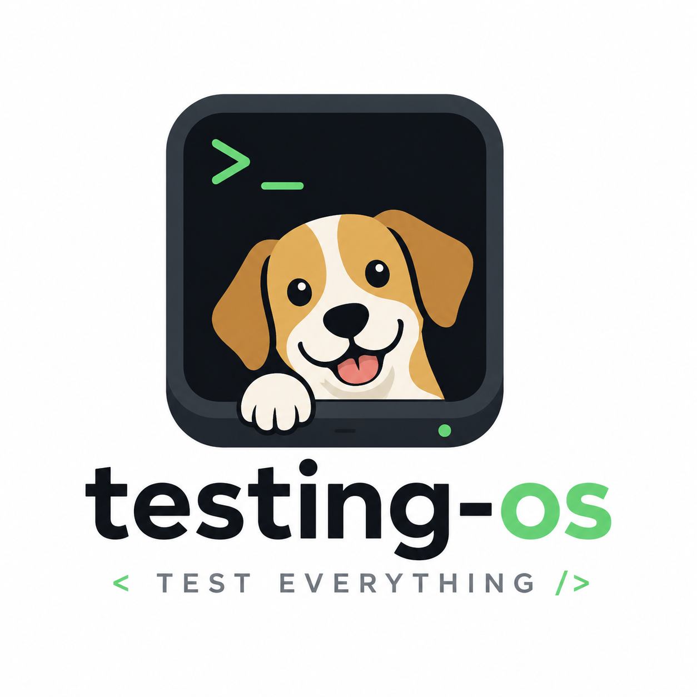

<p align="center">
  <a href="README.md">English</a> | <a href="README.zh.md">中文</a> | <a href="README.es.md">Español</a> | <a href="README.fr.md">Français</a> | <a href="README.hi.md">हिन्दी</a> | <a href="README.it.md">Italiano</a> | <a href="README.pt-BR.md">Português (BR)</a>
</p>

<p align="center">
  
</p>

<div align="center">

# testing-os

[](https://github.com/dogfood-lab/testing-os/actions/workflows/ci.yml)
[](https://codecov.io/gh/dogfood-lab/testing-os)
[](https://dogfood-lab.github.io/testing-os/)
[](https://dogfood-lab.github.io/testing-os/handbook/read-model/)
[](LICENSE)
[](package.json)

**AI時代におけるテスト用のオペレーティングシステム**

*AIによるソフトウェア支援のためのプロトコル、証拠ストア、および学習ループ。*

<!-- version:start -->
**v1.24.0** — 現在のリリース。変更点は[CHANGELOG.md](CHANGELOG.md)を参照してください。
<!-- version:end -->

📖 **[ハンドブックを読む →](https://dogfood-lab.github.io/testing-os/handbook/)**

</div

---

## これは何ですか

`testing-os`は、AIネイティブなワークフローで、リポジトリの実際のテスト証拠を記録、検証し、そこから学習します。リポジトリを指し示すと、すべてのテスト実行は、信頼できるProvenance（出所）が確認されたレコードになります。これは、自己申告による合格ではありません。

得られるもの：

- **Provenance（出所）が確認されたレコード。**すべての提出物は、受け入れられる前に、実際のCI実行にバインドされます（キーレスで、プロバイダー自身のIDを使用）。その結果、改ざんが検知可能な、追記専用の証拠ストアとなり、単なる「合格」のチェックマークではありません。
- **制御可能なポリシー契約。**YAMLで「検証済み」と見なすものを宣言します。これは、境界が定められた、評価を含まない述語DSL（`field`/`op`/`value` + `all`/`any`/`not`/`implies`）であり、リポジトリ全体で強制することができます。ポリシーをリリースする前に、`dogfood-verify lint`でlintを実行します。
- **並列エージェントスウォームプロトコル。**コードベースに対してマルチエージェント監査を実行し、生の調査結果を再利用可能なパターンとドクトリンに変換します。
- **ライブステータスサーフェス。**リポジトリごとのレコード、インデックス、およびステータスバッジはすべて、1つの証拠ストアから提供されます。
- **リポジトリの動作方法を示すページ。**Atlasは、リポジトリのワークフローとマニフェスト、実行するツール、インポート、書き込み、および履歴を読み取り、`atlas/README.md`を書き込みます。つまり、何が入力され、何が実行され、どこに保存され、誰が読み取り、何が何に影響を与え、前回から何が変更され、どこから始めるかを示します。そこに書かれている文章は、人が書いたものではありません。`atlas check`は、マップがコードと一致しなくなった場合にCIを失敗させ、`atlas explain`は、ファイル、ディレクトリ、またはパーツがシステム内で何であるかを回答し、`atlas mcp`は、エージェントがセッション中に同じ質問をマップに尋ねることを可能にし、すべてのプルリクエストには、構造的なデルタがコメントとして追加されます。`atlas check`は、通知として、ジョブがツールが受け入れないNodeバージョンをピンした場合、またはジョブのプラットフォームにネイティブバインディングが含まれていないロックファイルから`npm ci`を実行した場合にも通知します。また、そのアップストリームのクローンには、より新しいマップが保持されているrefが通知されます。

これは、[Dogfood Lab](https://github.com/dogfood-lab)組織の主要なモノリポジトリであり、8つの`@dogfood-lab/*`パッケージが、1つの`swarm`CLIと1つの`atlas`CLIで構成されています。

## クイックスタート

```bash
npm install -g @dogfood-lab/dogfood-swarm
swarm --help
```

独自のレポジトリのテスト証拠をここに記録したいですか？**[`examples/`スターターキット](examples/)**を使用すると、5分で開始できます（`dogfood-report`は提出物をビルドし、`dogfood-init`はワークフローをスキャフォールドします）。オペレーターガイド、CLIリファレンス、スキーマリファレンス、および統合レシピは、**[ハンドブック](https://dogfood-lab.github.io/testing-os/handbook/)**にあります。バージョンごとの詳細は、[CHANGELOG.md](CHANGELOG.md)にあります。

## プライベートな環境で実行する

パブリックサイトは、Atlasを採用したすべてのパブリックリポジトリをレンダリングします。マシンから出さないようにする必要があるリポジトリの場合、同じエンジンは、永続的なメモリを持つコンテナとして提供されます。

```bash
mkdir -p atlas-data repos
cp docker/fleet.example.yml atlas-data/fleet.yml   # list your repositories, by mounted path or clone URL
docker compose -f docker/compose.example.yml up -d
```

`./atlas-data`がメモリです。`fleet.yml`は、すべてのレンダリング、各リポジトリの履歴、および状態です。サービスは、メモリが空の状態で起動時に1回マップし、次に`fleet.yml`のスケジュールに従ってマップし、`http://127.0.0.1:8080/`でフリートリスト、各ページを`/?repo=owner/name`で、およびエージェント用のインデックスを`/llms.txt`で提供します。リストされたリポジトリのgitフェッチを除いて、コンテナから何も出力されません。`./atlas-data`を削除すると、すべてが忘れられます。同じイメージは、1つのリポジトリでCLIを実行します。`docker run --rm -v "$PWD:/repo" ghcr.io/dogfood-lab/atlas map`。コマンドを実行すると、ファイル構造は[`docker/README.md`](docker/README.md)にあります。

## 脅威モデル

testing-osは、`mcp-tool-shop-org/*`と`dogfood-lab/*`の下にある信頼できるGitHubリポジトリから、`repository_dispatch`を介して送信されたdogfood提出物を処理します。検証者は、CIのProvenance（出所）を必要とします。主張された実行IDは、プロバイダーのAPIを介して確認され、形状が不正、参照が欠落している、またはポリシーの主張が無効な提出物は拒否されます。

**Provenance（出所）が認証です。**`github`の提出物について、検証者は、主張されたGitHub Actions実行が実際に存在すること（GitHub API）を確認し、提出物の`repo`と`commit_sha`をその確認された実行にバインドします。これは、ライブでキーレスのチェックであり、GitHub自身のOIDC IDに根ざしているため、レコードは、実際には発生しなかった実行またはコミットを証明することはできません。**GitLab CI**は、オプションでサポートされています（`source.provider: gitlab`）。GitLabの提出物は、検証者が非GitHubホストを呼び出す唯一のケースであり（`gitlab.com/api`）、それも`gitlab`の提出物に対してのみです。

**Record integrity is tamper-EVIDENT, not tamper-proof.** Every persisted record carries an `integrity` block (`submission_digest` + `prev_digest`) forming an append-only hash chain that `node packages/ingest/run.js --verify-chain` validates fully offline — detecting out-of-band tampering, disk corruption, and partial restores. Stub provenance, which confirms any claim without an API call, exists for local development only: it is refused in CI, and it writes a record only under an explicitly named `INGEST_REPO_ROOT`, so a stub record cannot enter this repository's own chain. The chain does **not** defend against the ingest credential itself, which can rewrite both a record and the chain; closing that needs an anchor outside the writer's control. An **optional, off-by-default XRPL anchor** (`node packages/ingest/run.js --anchor-*`) witnesses the chain head to the public XRP Ledger, making any truncation or rewrite below an anchored point detectable — the second disclosed non-GitHub call, and only when an operator enables it.

**テスト環境がアクセスする内容：** 各 `repository_dispatch` ペイロード内の送信JSON、およびこのリポジトリ内の `policies/`、`fixtures/`、`records/`、`indexes/`、`dogfood/roadmap/`（最後のものは、オペレーターによって呼び出された `swarm roadmap compile` によってのみ書き込まれ、自動化されたインジェストパスによって書き込まれることはありません）、検証のための `api.github.com` へのアウトバウンド呼び出し、および `github` の送信のみに適用される、送信リポジトリの `dogfood/scenarios/<scenario_id>.yaml` の読み取り専用フェッチ（アテストされたコミット時点でのもので、必要なステップの強制に使用されるシナリオ定義です。使用前にサイズ制限とスキーマ検証が行われ、ファイルが存在しない場合は、そのチェックは実行されず、目に見える警告が表示されます）。

**テスト環境がアクセスしない内容：** 宣言された `dogfood/scenarios/` 定義ファイルを超えた、消費者のソースコード、消費者のリポジトリ内の、ディスパッチエンベロープを超えた秘密情報、またはこのリポジトリのワーキングツリー外のすべてのもの。

**検出状態の遷移は、証拠となるものであり、付加専用です。** スウォーム制御プレーンのクローズ動詞（`swarm reopen`、`swarm close`）には、明示的な理由、証拠、およびオペレーターによるクローズの場合は、宣言された検証モードが必要です。すべての遷移は、実行した権限を記録する不変の `finding_events` 行を書き込みます。自動化されたパスで、陳腐化に基づいて検出をクローズしたり、予測によって再開したりすることはできず、どの動詞もイベント履歴を書き換えることはできません。誤って使用された認証情報は、遷移を追加できますが、各追加自体が記録されます。

**ネットワークの範囲。** デフォルトでは、唯一の送信先は `api.github.com` です（読み取り専用：検証の確認 + 上記のシナリオ定義のフェッチ）。例外は2つあり、どちらもオプトインであり、上記で開示されています。GitLabプロバイダーによる送信（`gitlab.com/api`）、およびオペレーターによって有効になったXRPLアンカーの実行です。**テレメトリや分析は行いません。このコードベースは、外部に情報を送信しません。上記の2つのオプトインパスがない場合、GitHubを超えてネットワークの範囲を公開することはありません。** 受信ワークフローは、このリポジトリのみにスコープされた `contents: write` で実行されます。

## パッケージ

| パッケージ | ソース | 目的 |
|---------|--------|---------|
| `@dogfood-lab/schemas` | TypeScript | 8つのJSONスキーマ（記録、検出、パターン、推奨事項、教義、ポリシー、シナリオ、送信）。 |
| `@dogfood-lab/verify` | JS | 中央の送信バリデーター。送信は、保存される前にここを通過します。 |
| `@dogfood-lab/findings` | JS | 検出コントラクト + 派生/レビュー/合成/アドバイスのパイプライン。 |
| `@dogfood-lab/ingest` | JS | パイプラインのグルー：ディスパッチ → 検証 → 永続化 → インデックス作成。 |
| `@dogfood-lab/report` | JS | ソースリポジトリの送信ビルダー。 |
| `@dogfood-lab/portfolio` | JS | クロスリポジトリのポートフォリオジェネレーター。 |
| `@dogfood-lab/dogfood-swarm` | JS | 10段階の並列エージェントプロトコル + SQLite制御プレーン + `swarm` バイナリ。 |
| `@dogfood-lab/atlas` | JS | リポジトリを読み取り、その動作方法を記述したページを書き込みます（`atlas/README.md`）。`atlas check` は、CIでマップをゲートし、`atlas mcp` はそれからエージェントに応答します。兄弟依存関係はありません。任意のレポジトリで実行できます。 |

**独立性を維持しながら、公開APIを通じて統合する** 兄弟のテストツール：[`shipcheck`](https://github.com/mcp-tool-shop-org/shipcheck)、[`repo-knowledge`](https://github.com/mcp-tool-shop-org/repo-knowledge)、[`ai-eyes-mcp`](https://github.com/mcp-tool-shop-org/ai-eyes-mcp)、[`taste-engine`](https://github.com/mcp-tool-shop-org/taste-engine)、[`style-dataset-lab`](https://github.com/mcp-tool-shop-org/style-dataset-lab)。

## レイアウト

```
testing-os/
├── packages/                  # 8 workspace packages (@dogfood-lab/*)
├── atlas/                     # This repository's own Atlas page and map, written by `atlas map`
├── site/                      # Astro Starlight handbook → dogfood-lab.github.io/testing-os/handbook/
├── swarms/                    # Swarm-run artifacts + control-plane.db
├── indexes/                   # Generated read API: latest-by-repo.json, failing.json, stale.json, trends.json, badges/ (shields.io endpoints)
├── policies/                  # Policy YAML by repo
├── records/                   # Submission landing pad (ingest.yml writes here)
├── fixtures/                  # Test/example fixtures
├── docs/                      # Contract docs + architecture notes
├── examples/                  # Copy-paste consumer starter kit (dogfood.yml + scenario + policy)
├── scripts/                   # Repo-level utilities (sync-version, build)
└── .github/workflows/         # ci.yml, ingest.yml, pages.yml, release.yml, self-dogfood.yml, atlas-render.yml
```

## ローカル開発

```bash
git clone https://github.com/dogfood-lab/testing-os.git
cd testing-os
npm install
npm run build       # tsc --build across all packages
npm test            # vitest for schemas, node --test for the rest
npm run verify      # version-sync + doc-drift + regression-pin gates + build + tests (canonical pre-commit check — NOT the same as build && test)
```

Node ≥ 22が必要です。CIマトリックスは、`ubuntu-latest` で Node 22 + 24 を実行し、ローカルで Node 25 で検証します。

**サポートされているファイルシステム：** APFS、HFS+、ext4（CIベースライン）、NTFS — POSIX `link(2)` を実装しているもの。**サポートされていません：** exFAT、FAT32。[`packages/findings/lib/file-lock.js`](packages/findings/lib/file-lock.js) のファイルロックCASは、アトミックな公開のためにハードリンクセマンティクスを必要とします。exFATでは、`linkSync` が `ENOTSUP` をスローします（静かにではなく、大きな警告が表示されます）。一般的な落とし穴：クロスプラットフォームの外部SSDは、多くの場合、exFATでフォーマットされています。リポジトリをローカルのAPFS/HFS+にクローンしてください。完全なSession G検証マトリックスについては、[`docs/m5-validation-2026-04-29.md`](docs/m5-validation-2026-04-29.md) を参照してください。

## バージョン管理

すべての `@dogfood-lab/*` パッケージは、まとめて更新されます。7つのパッケージは、v1.24.0で、ロックステップで `@dogfood-lab` に公開されます（`schemas`、`verify`、`report`、`ingest`、`findings`、`dogfood-swarm`、`atlas`）。8番目のパッケージである `@dogfood-lab/portfolio` は、内部で使用されます。このREADMEの先頭近くにあるバージョン行は、すべての `npm run build` で、[`scripts/sync-version.mjs`](scripts/sync-version.mjs) を介して `package.json` から自動的にタイムスタンプが付けられます。

## ライセンス

[MIT](LICENSE) © 2026 mcp-tool-shop

---

<div align="center">

**[ハンドブック](https://dogfood-lab.github.io/testing-os/handbook/)** · **[すべてのリポジトリ](https://github.com/orgs/dogfood-lab/repositories)** · **[プロファイル](https://github.com/dogfood-lab)**

*まず食べて、次に送信する。*

</div
