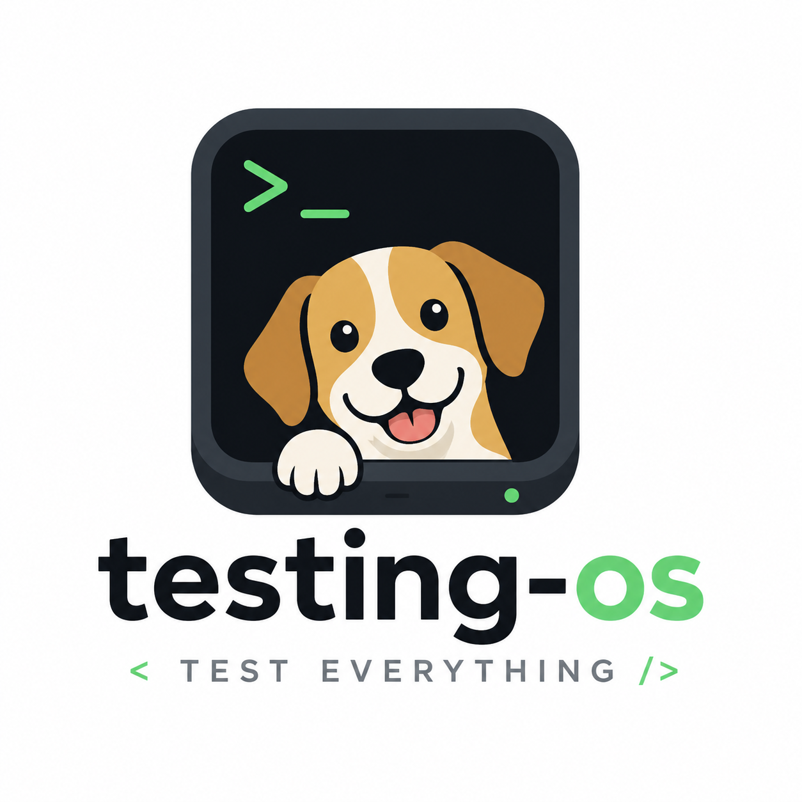

<p align="center">
  <a href="README.ja.md">日本語</a> | <a href="README.zh.md">中文</a> | <a href="README.es.md">Español</a> | <a href="README.fr.md">Français</a> | <a href="README.hi.md">हिन्दी</a> | <a href="README.it.md">Italiano</a> | <a href="README.pt-BR.md">Português (BR)</a>
</p>

<p align="center">
  
</p>

<div align="center">

# testing-os

[](https://github.com/dogfood-lab/testing-os/actions/workflows/ci.yml)
[](https://dogfood-lab.github.io/testing-os/)
[](LICENSE)
[](package.json)

**Operating system for testing in the AI era**

*Protocols, evidence stores, and learning loops for AI-assisted software.*

<!-- version:start -->
**v1.1.1** — 7 packages (`@dogfood-lab/*`), workspace-wide test suite, ingest receiver live, handbook deployed.
<!-- version:end -->

📖 **[Read the handbook →](https://dogfood-lab.github.io/testing-os/)**

</div>

---

## What This Is

`testing-os` is the flagship monorepo of the [Dogfood Lab](https://github.com/dogfood-lab) GitHub org — successor to the now-archived [`mcp-tool-shop-org/dogfood-labs`](https://github.com/mcp-tool-shop-org/dogfood-labs). It bundles the protocols and infrastructure for running, recording, and learning from tests in an AI-native development workflow:

- A **swarm protocol** for running parallel-agent audits against a codebase.
- An **evidence store + schema spine** for the records, findings, patterns, and recommendations that come out of those runs.
- A **policy + verifier** layer that decides what counts as "verified" — and enforces it across consumer repos.
- An **intelligence layer** that turns raw findings into reusable patterns and doctrine.

## Status

**v1.0.0 stable** — first stable release after the migration from `mcp-tool-shop-org/dogfood-labs` (cut 2026-04-25). Receiver is live: `dogfood.yml` workflows in consumer repos dispatch to this repo, and [`.github/workflows/ingest.yml`](.github/workflows/ingest.yml) commits the resulting records and indexes back to `main`. Handbook is deployed at [dogfood-lab.github.io/testing-os/](https://dogfood-lab.github.io/testing-os/). Consumers can pin to `^1.0.0`. See [CHANGELOG.md](CHANGELOG.md) for what's in the cut.

## Threat Model

testing-os processes dogfood submissions dispatched via `repository_dispatch` from trusted GitHub repos under `mcp-tool-shop-org/*` and `dogfood-lab/*`. The verifier requires GitHub Actions provenance — claimed run IDs are confirmed via the GitHub API, and submissions with malformed shapes, missing references, or invalid policy claims are rejected.

**What testing-os touches:** the submission JSON in each `repository_dispatch` payload; `policies/`, `fixtures/`, `records/`, and `indexes/` in this repo; outbound calls to `api.github.com` for provenance verification.

**What testing-os does NOT touch:** consumer source code, secrets in consumer repos beyond the dispatch envelope, or anything outside this repo's working tree.

**Permissions required:** the receiver workflow runs with `contents: write` scoped to this repo only. Provenance verification uses the workflow's default `GITHUB_TOKEN` for read-only Actions API calls. **No telemetry, no third-party services, no analytics — this codebase neither phones home nor exposes a network surface beyond GitHub.**

## Packages

| Package | Source | Purpose |
|---------|--------|---------|
| `@dogfood-lab/schemas` | TypeScript | The 8 JSON schemas (record, finding, pattern, recommendation, doctrine, policy, scenario, submission). |
| `@dogfood-lab/verify` | JS | Central submission validator. Submissions pass through here before they're persisted. |
| `@dogfood-lab/findings` | JS | Finding contract + derive/review/synthesis/advise pipelines. |
| `@dogfood-lab/ingest` | JS | Pipeline glue: dispatch → verify → persist → index. |
| `@dogfood-lab/report` | JS | Submission builder for source repos. |
| `@dogfood-lab/portfolio` | JS | Cross-repo portfolio generator. |
| `@dogfood-lab/dogfood-swarm` | JS | The 10-phase parallel-agent protocol + SQLite control plane + `swarm` bin. |

Sibling testing tools that **stay independent** but integrate via published APIs: [`shipcheck`](https://github.com/mcp-tool-shop-org/shipcheck), [`repo-knowledge`](https://github.com/mcp-tool-shop-org/repo-knowledge), [`ai-eyes-mcp`](https://github.com/mcp-tool-shop-org/ai-eyes-mcp), [`taste-engine`](https://github.com/mcp-tool-shop-org/taste-engine), [`style-dataset-lab`](https://github.com/mcp-tool-shop-org/style-dataset-lab).

## Layout

```
testing-os/
├── packages/                  # 7 workspace packages (@dogfood-lab/*)
├── site/                      # Astro Starlight handbook → dogfood-lab.github.io/testing-os/
├── swarms/                    # Swarm-run artifacts + control-plane.db
├── indexes/                   # Generated read API: latest-by-repo.json, failing.json, stale.json
├── policies/                  # Policy YAML by repo
├── records/                   # Submission landing pad (ingest.yml writes here)
├── fixtures/                  # Test/example fixtures
├── docs/                      # Contract docs + architecture notes
├── scripts/                   # Repo-level utilities (sync-version, build)
└── .github/workflows/         # ci.yml, ingest.yml, pages.yml
```

## Local Development

```bash
git clone https://github.com/dogfood-lab/testing-os.git
cd testing-os
npm install
npm run build       # tsc --build across all packages
npm test            # vitest for schemas, node --test for the rest
npm run verify      # build + test (canonical pre-commit check)
```

Requires Node ≥ 20.

## Versioning

Lockstep across all `@dogfood-lab/*` packages — they bump together. The version line in this README is auto-stamped from `package.json` via `scripts/sync-version.mjs` (runs as `prebuild`). All packages are `private: true` for now; npm publish is a separate decision per package.

## License

[MIT](LICENSE) © 2026 mcp-tool-shop

---

<div align="center">

**[Handbook](https://dogfood-lab.github.io/testing-os/)** · **[All Repositories](https://github.com/orgs/dogfood-lab/repositories)** · **[Profile](https://github.com/dogfood-lab)**

*Eat first. Ship second.*

</div>
