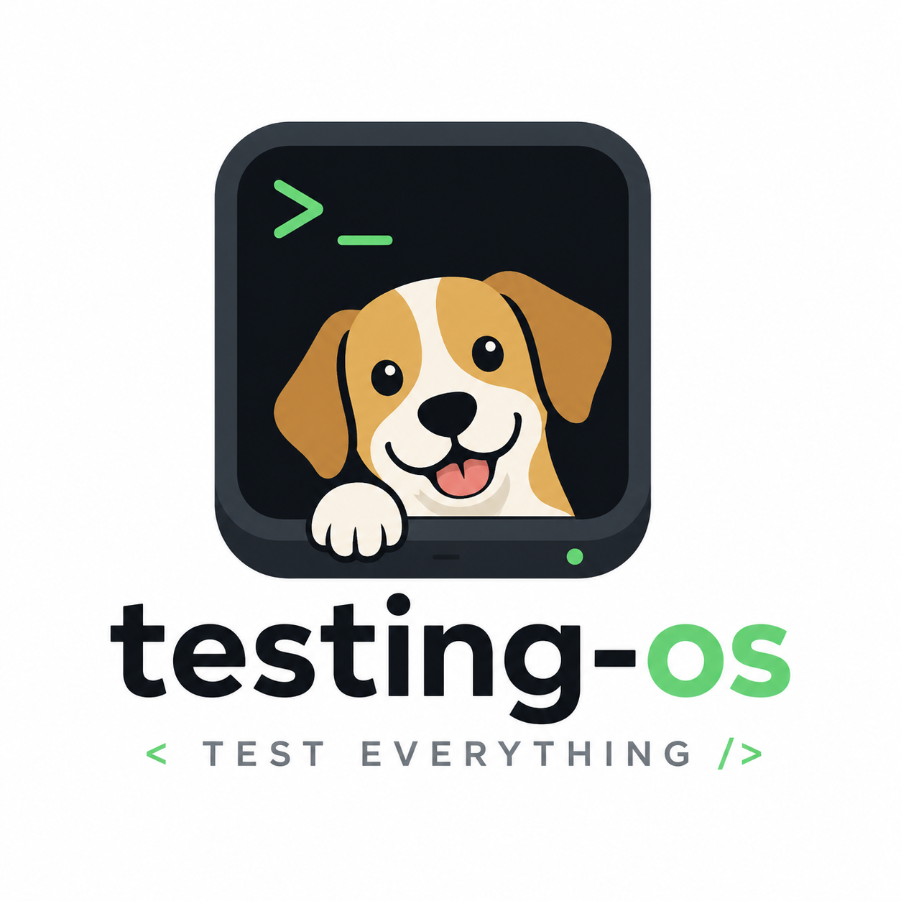

<p align="center">
  <a href="README.ja.md">日本語</a> | <a href="README.zh.md">中文</a> | <a href="README.es.md">Español</a> | <a href="README.fr.md">Français</a> | <a href="README.hi.md">हिन्दी</a> | <a href="README.it.md">Italiano</a> | <a href="README.md">English</a>
</p>

<p align="center">
  
</p>

<div align="center">

# testing-os

[](https://github.com/dogfood-lab/testing-os/actions/workflows/ci.yml)
[](https://dogfood-lab.github.io/testing-os/)
[](https://dogfood-lab.github.io/testing-os/handbook/read-model/)
[](LICENSE)
[](package.json)

**Sistema operacional para testes na era da IA**

*Protocolos, repositórios de evidências e ciclos de aprendizado para software assistido por IA.*

<!-- version:start -->
**v1.20.0** — versão atual. Consulte [CHANGELOG.md](CHANGELOG.md) para ver o que foi incluído.
<!-- version:end -->

📖 **[Leia o manual →](https://dogfood-lab.github.io/testing-os/handbook/)**

</div

---

## O que é isso

`testing-os` registra, verifica e aprende com as evidências reais de teste do seu repositório em um fluxo de trabalho nativo de IA. Aponte-o para um repositório e cada execução de teste se torna um registro com confirmação de procedência no qual você pode confiar — e não apenas uma aprovação auto-relatada.

O que você obtém:

- **Registros com confirmação de procedência.** Cada envio está vinculado a uma execução real de CI — sem necessidade de chaves, por meio da própria identidade do provedor — antes de ser aceito. O resultado é um repositório de evidências à prova de adulteração e com apenas adições, e não apenas uma marcação verde baseada na confiança.
- **Um contrato de política que você controla.** Declare o que conta como "verificado" em YAML — um DSL de predicados limitado e sem avaliação (`field`/`op`/`value` + `all`/`any`/`not`/`implies`) — e aplique-o em todos os seus repositórios. Valide uma política antes de enviá-la com `dogfood-verify lint`.
- **Um protocolo de enxame de agentes paralelos.** Execute auditorias multiagente em uma base de código e, em seguida, transforme os resultados brutos em padrões e doutrinas reutilizáveis.
- **Uma superfície de status em tempo real.** Registros e índices por repositório, além de um selo de status, tudo servido a partir de um único repositório de evidências.
- **Uma página que mostra como um repositório funciona.** O Atlas lê os fluxos de trabalho e os manifestos de um repositório, as ferramentas que ele executa, suas importações, gravações e histórico, e escreve `atlas/README.md`: o que entra, o que é executado, onde é armazenado, quem o lê, o que causa falhas, o que mudou desde o último mapa e por onde começar. Nenhuma frase é escrita por uma pessoa; `atlas check` faz com que a CI falhe quando o mapa para de corresponder ao código, `atlas explain <file>` responde o que um arquivo contém no sistema e cada solicitação de pull recebe o delta estrutural como um comentário.

É o monoreposito principal da organização [Dogfood Lab](https://github.com/dogfood-lab) — oito pacotes `@dogfood-lab/*` por trás de uma CLI `swarm` e uma CLI `atlas`.

## Início rápido

```bash
npm install -g @dogfood-lab/dogfood-swarm
swarm --help
```

Want your own repo's test evidence recorded here? The **[`examples/` starter kit](examples/)** gets you dispatching in five minutes (`dogfood-report` builds the submission; `dogfood-init` scaffolds the workflow). The operator's guide, CLI reference, schema reference, and integration recipes live in the **[handbook](https://dogfood-lab.github.io/testing-os/handbook/)**. Per-version detail is in [CHANGELOG.md](CHANGELOG.md).

## Execute-o para uma frota privada

O site público renderiza todos os repositórios públicos que adotaram o Atlas. Para repositórios que não devem sair da sua máquina, o mesmo mecanismo é fornecido como um contêiner com memória persistente:

```bash
mkdir -p atlas-data repos
cp docker/fleet.example.yml atlas-data/fleet.yml   # list your repositories, by mounted path or clone URL
docker compose -f docker/compose.example.yml up -d
```

`./atlas-data` é a memória: `fleet.yml`, cada renderização, o histórico de cada repositório e o estado. O serviço é mapeado uma vez no início, quando a memória está vazia, e depois de acordo com o agendamento em `fleet.yml`, e serve a lista da frota em `http://127.0.0.1:8080/` e cada página em `/?repo=owner/name`. Nada sai do contêiner, exceto as buscas de repositórios que você listou; excluir `./atlas-data` é a única maneira de esquecer. A mesma imagem executa a CLI em um repositório: `docker run --rm -v "$PWD:/repo" ghcr.io/dogfood-lab/atlas map`. Execute os comandos e as formas dos arquivos estão em [`docker/README.md`](docker/README.md).

## Modelo de ameaças

O testing-os processa os envios do dogfood enviados por meio de `repository_dispatch` de repositórios GitHub confiáveis sob `mcp-tool-shop-org/*` e `dogfood-lab/*`. O verificador exige a procedência da CI — os IDs de execução reivindicados são confirmados por meio da API do provedor, e os envios com formas malformadas, referências ausentes ou reivindicações de política inválidas são rejeitados.

**A procedência é a garantia.** Para um envio `github`, o verificador confirma que a execução do GitHub Actions reivindicada realmente existe (API do GitHub) e vincula o `repo` e o `commit_sha` do envio a essa execução confirmada — uma verificação ao vivo e sem necessidade de chaves, enraizada na própria identidade OIDC do GitHub, para que um registro não possa atestar uma execução ou um commit que não ocorreu. O **GitLab CI** é suportado opcionalmente (`source.provider: gitlab`); um envio do GitLab é o único caso em que o verificador chama um host que não é do GitHub (`gitlab.com/api`), e apenas para envios `gitlab`.

**A integridade do registro é à prova de adulteração, mas não à prova de adulteração total.** Cada registro persistido carrega um bloco `integrity` (`submission_digest` + `prev_digest`) formando uma cadeia de hash com apenas adições que `node packages/ingest/run.js --verify-chain` valida totalmente offline — detectando adulterações externas, corrupção de disco e restaurações parciais. Ele **não** se defende contra a credencial de ingestão em si, que pode reescrever tanto um registro quanto a cadeia; fechar isso requer uma âncora fora do controle do escritor. Uma âncora **opcional, desativada por padrão no XRPL** (`node packages/ingest/run.js --anchor-*`) testemunha o cabeçalho da cadeia no XRP Ledger público, tornando qualquer truncamento ou reescrita abaixo de um ponto ancorado detectável — a segunda chamada divulgada que não é do GitHub, e apenas quando um operador a habilita.

**O que o testing-os afeta:** o JSON de envio em cada carga útil `repository_dispatch`; `policies/`, `fixtures/`, `records/`, `indexes/` e `dogfood/roadmap/` neste repositório (o último é escrito apenas por um `swarm roadmap compile` invocado por um operador — nunca pelo caminho automatizado de ingestão); chamadas de saída para `api.github.com` para verificação de proveniência; e — apenas para envios `github` — uma recuperação somente leitura do `dogfood/scenarios/<scenario_id>.yaml` do repositório de envio no commit comprovado (a definição de cenário que impulsiona a aplicação de etapas obrigatórias; com tamanho limitado e validado pelo esquema antes do uso, arquivos ausentes simplesmente deixam essa verificação sem ser aplicada, com um aviso visível).

**O que o testing-os NÃO afeta:** código-fonte do consumidor além dos arquivos de definição `dogfood/scenarios/` declarados, segredos nos repositórios do consumidor além do envelope de envio ou qualquer coisa fora da árvore de trabalho deste repositório.

**As transições de estado de descoberta são evidências e são apenas de adição.** Os verbos de fechamento do plano de controle do enxame (`swarm reopen`, `swarm close`) exigem uma razão explícita, evidências e — para fechamentos de operador — um modo de verificação declarado; cada transição grava uma linha `finding_events` imutável, registrando a autoridade que está agindo. Nenhum caminho automatizado pode fechar uma descoberta com base na falta de atualização ou reabri-la por previsão, e nenhum verbo pode reescrever o histórico de eventos — uma credencial usada incorretamente pode adicionar transições, mas cada adição é, em si, registrada.

**Superfície de rede.** Por padrão, a única saída é `api.github.com` (somente leitura: confirmação de proveniência + a recuperação da definição de cenário acima). As duas exceções são opcionais e divulgadas acima: um envio do provedor GitLab (`gitlab.com/api`) e uma execução de âncora XRPL habilitada pelo operador. **Sem telemetria, sem análise — esta base de código nunca se conecta à rede; na ausência desses dois caminhos opcionais, ela não expõe nenhuma superfície de rede além do GitHub.** O fluxo de trabalho do receptor é executado com `contents: write`, restrito apenas a este repositório.

## Pacotes

| Pacote | Fonte | Propósito |
|---------|--------|---------|
| `@dogfood-lab/schemas` | TypeScript | Os 8 esquemas JSON (registro, descoberta, padrão, recomendação, doutrina, política, cenário, envio). |
| `@dogfood-lab/verify` | JS | Validador central de envio. Os envios passam por aqui antes de serem persistidos. |
| `@dogfood-lab/findings` | JS | Contrato de descoberta + pipelines de derivação/revisão/síntese/aconselhamento. |
| `@dogfood-lab/ingest` | JS | Conexão do pipeline: envio → verificação → persistência → indexação. |
| `@dogfood-lab/report` | JS | Construtor de envio para repositórios de origem. |
| `@dogfood-lab/portfolio` | JS | Gerador de portfólio entre repositórios. |
| `@dogfood-lab/dogfood-swarm` | JS | O protocolo de agente paralelo de 10 fases + plano de controle SQLite + `swarm` bin. |
| `@dogfood-lab/atlas` | JS | Lê um repositório e grava a página que diz como ele funciona (`atlas/README.md`); `atlas check` controla o mapa no CI. Sem dependências entre arquivos; executa em qualquer repositório. |

Ferramentas de teste paralelas que **permanecem independentes**, mas se integram por meio de APIs publicadas: [`shipcheck`](https://github.com/mcp-tool-shop-org/shipcheck), [`repo-knowledge`](https://github.com/mcp-tool-shop-org/repo-knowledge), [`ai-eyes-mcp`](https://github.com/mcp-tool-shop-org/ai-eyes-mcp), [`taste-engine`](https://github.com/mcp-tool-shop-org/taste-engine), [`style-dataset-lab`](https://github.com/mcp-tool-shop-org/style-dataset-lab).

## Layout

```
testing-os/
├── packages/                  # 8 workspace packages (@dogfood-lab/*)
├── atlas/                     # This repository's own Atlas page and map, written by `atlas map`
├── site/                      # Astro Starlight handbook → dogfood-lab.github.io/testing-os/handbook/
├── swarms/                    # Swarm-run artifacts + control-plane.db
├── indexes/                   # Generated read API: latest-by-repo.json, failing.json, stale.json, trends.json, badges/ (shields.io endpoints)
├── policies/                  # Policy YAML by repo
├── records/                   # Submission landing pad (ingest.yml writes here)
├── fixtures/                  # Test/example fixtures
├── docs/                      # Contract docs + architecture notes
├── examples/                  # Copy-paste consumer starter kit (dogfood.yml + scenario + policy)
├── scripts/                   # Repo-level utilities (sync-version, build)
└── .github/workflows/         # ci.yml, ingest.yml, pages.yml, release.yml, self-dogfood.yml, atlas-render.yml
```

## Desenvolvimento local

```bash
git clone https://github.com/dogfood-lab/testing-os.git
cd testing-os
npm install
npm run build       # tsc --build across all packages
npm test            # vitest for schemas, node --test for the rest
npm run verify      # version-sync + doc-drift + regression-pin gates + build + tests (canonical pre-commit check — NOT the same as build && test)
```

Requer Node ≥ 22. A matriz de CI executa Node 22 + 24 em `ubuntu-latest`; validado localmente em Node 25.

**Sistemas de arquivos suportados:** APFS, HFS+, ext4 (linha de base do CI), NTFS — qualquer um que implemente POSIX `link(2)`. **Não suportado:** exFAT, FAT32. O CAS de bloqueio de arquivo em [`packages/findings/lib/file-lock.js`](packages/findings/lib/file-lock.js) requer semântica de link rígido para publicação atômica; no exFAT, `linkSync` lança `ENOTSUP` (alto, não silencioso). Um problema comum: SSDs externos multiplataforma geralmente são formatados em exFAT — clone o repositório para APFS/HFS+ local em vez disso. Consulte [`docs/m5-validation-2026-04-29.md`](docs/m5-validation-2026-04-29.md) para a matriz de validação completa da Sessão G.

## Versionamento

Todos os pacotes `@dogfood-lab/*` são atualizados juntos — um número em todo o monorepos. Sete pacotes são publicados no npm sob `@dogfood-lab` na versão 1.20.0 em sincronia (`schemas`, `verify`, `report`, `ingest`, `findings`, `dogfood-swarm`, `atlas`); o oitavo, `@dogfood-lab/portfolio`, permanece interno. A linha de versão perto do topo deste README é automaticamente carimbada a partir de `package.json` por meio de [`scripts/sync-version.mjs`](scripts/sync-version.mjs) em cada `npm run build`.

## Licença

[MIT](LICENSE) © 2026 mcp-tool-shop

---

<div align="center">

**[Manual](https://dogfood-lab.github.io/testing-os/handbook/)** · **[Todos os Repositórios](https://github.com/orgs/dogfood-lab/repositories)** · **[Perfil](https://github.com/dogfood-lab)**

*Coma primeiro. Envie depois.*

</div
