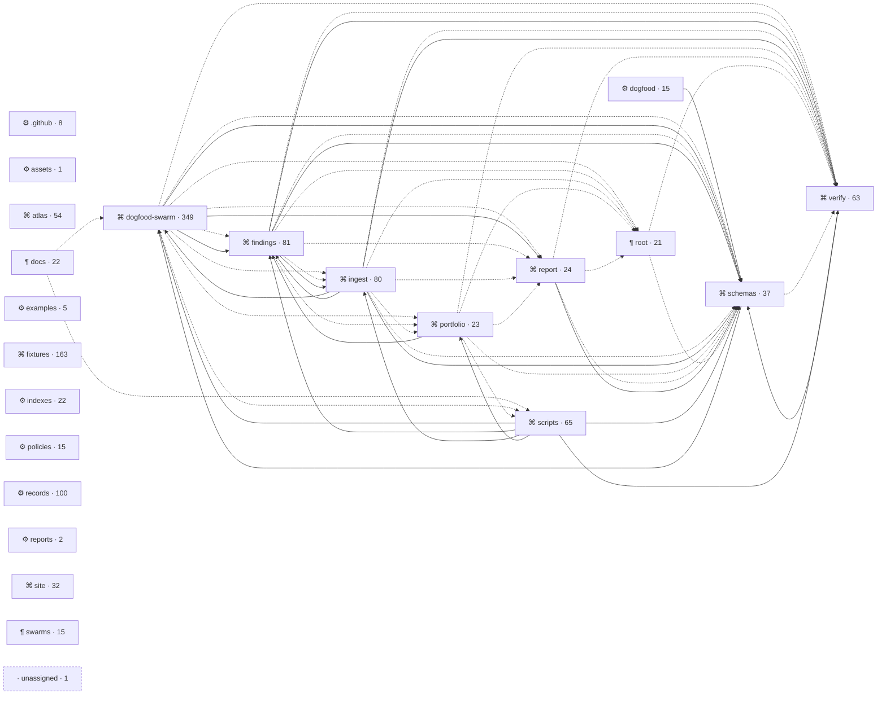

◷ numbers as of 2026-09-22 · 0 days ago · structure @ f7a432b

## Map

The matrix is on the site.

## Hotspots

◷ numbers as of 2026-09-22 · 0 days ago

⚠ low confidence

churn is the sum of lines, added plus deleted, over the boundary's files.

| boundary | churn | cohesion | unresolved sites | import confidence |
| --- | --- | --- | --- | --- |
| dogfood-swarm | 176919 | 0.417751 | 5 | full |
| scripts | 45169 | 0.420561 | 6 | full |
| site | 25783 | none | 0 | full |
| ingest | 25628 | none | 0 | full |
| findings | 23368 | none | 0 | full |
| dogfood | 17440 | none | 0 | full |
| verify | 16626 | 1 | 0 | full |
| root | 14130 | none | 0 | full |
| atlas | 13574 | none | 0 | full |
| schemas | 10250 | none | 0 | full |
| portfolio | 7961 | 0.424242 | 4 | full |
| records | 7853 | none | 0 | full |
| docs | 7803 | none | 0 | full |
| report | 5505 | none | 0 | full |
| swarms | 3675 | none | 0 | full |
| fixtures | 2745 | none | 15 | full |
| .github | 2690 | none | 0 | full |
| indexes | 2636 | none | 0 | full |
| reports | 1067 | none | 0 | full |
| policies | 374 | none | 0 | full |
| examples | 340 | none | 0 | full |
| assets | 0 | none | 0 | full |

## Breakage

◷ numbers as of 2026-09-22 · 0 days ago

⚠ low confidence

### .github

| relationship | boundaries |
| --- | --- |
| imports & co-changes | none |
| imports only | none |
| co-changes only | none |

### assets

| relationship | boundaries |
| --- | --- |
| imports & co-changes | none |
| imports only | none |
| co-changes only | none |

### atlas

| relationship | boundaries |
| --- | --- |
| imports & co-changes | none |
| imports only | none |
| co-changes only | none |

### docs

| relationship | boundaries |
| --- | --- |
| imports & co-changes | none |
| imports only | none |
| co-changes only | none |

### dogfood

| relationship | boundaries |
| --- | --- |
| imports & co-changes | none |
| imports only | none |
| co-changes only | none |

### dogfood-swarm

| relationship | boundaries |
| --- | --- |
| imports & co-changes | scripts |
| imports only | ingest · schemas |
| co-changes only | portfolio |

### examples

| relationship | boundaries |
| --- | --- |
| imports & co-changes | none |
| imports only | none |
| co-changes only | none |

### findings

| relationship | boundaries |
| --- | --- |
| imports & co-changes | none |
| imports only | dogfood-swarm · ingest · portfolio · scripts |
| co-changes only | none |

### fixtures

| relationship | boundaries |
| --- | --- |
| imports & co-changes | none |
| imports only | none |
| co-changes only | none |

### indexes

| relationship | boundaries |
| --- | --- |
| imports & co-changes | none |
| imports only | none |
| co-changes only | none |

### ingest

| relationship | boundaries |
| --- | --- |
| imports & co-changes | none |
| imports only | findings · scripts |
| co-changes only | none |

### policies

| relationship | boundaries |
| --- | --- |
| imports & co-changes | none |
| imports only | none |
| co-changes only | none |

### portfolio

| relationship | boundaries |
| --- | --- |
| imports & co-changes | scripts |
| imports only | none |
| co-changes only | dogfood-swarm |

### records

| relationship | boundaries |
| --- | --- |
| imports & co-changes | none |
| imports only | none |
| co-changes only | none |

### report

| relationship | boundaries |
| --- | --- |
| imports & co-changes | none |
| imports only | dogfood-swarm |
| co-changes only | none |

### reports

| relationship | boundaries |
| --- | --- |
| imports & co-changes | none |
| imports only | none |
| co-changes only | none |

### root

| relationship | boundaries |
| --- | --- |
| imports & co-changes | none |
| imports only | none |
| co-changes only | none |

### schemas

| relationship | boundaries |
| --- | --- |
| imports & co-changes | none |
| imports only | dogfood · dogfood-swarm · findings · ingest · report · scripts · verify |
| co-changes only | none |

### scripts

| relationship | boundaries |
| --- | --- |
| imports & co-changes | none |
| imports only | none |
| co-changes only | dogfood-swarm · portfolio |

### site

| relationship | boundaries |
| --- | --- |
| imports & co-changes | none |
| imports only | none |
| co-changes only | none |

### swarms

| relationship | boundaries |
| --- | --- |
| imports & co-changes | none |
| imports only | none |
| co-changes only | none |

### verify

| relationship | boundaries |
| --- | --- |
| imports & co-changes | none |
| imports only | findings · ingest · scripts |
| co-changes only | none |

## Pairs

◷ numbers as of 2026-09-22 · 0 days ago

⚠ low confidence

| a | b | shared | either | strength |
| --- | --- | --- | --- | --- |
| README.es.md | README.fr.md | 15 | 15 | 1 |
| README.es.md | README.hi.md | 15 | 15 | 1 |
| README.es.md | README.it.md | 15 | 15 | 1 |
| README.es.md | README.ja.md | 15 | 15 | 1 |
| README.es.md | README.pt-BR.md | 15 | 15 | 1 |
| README.es.md | README.zh.md | 15 | 15 | 1 |
| README.fr.md | README.hi.md | 15 | 15 | 1 |
| README.fr.md | README.it.md | 15 | 15 | 1 |
| README.fr.md | README.ja.md | 15 | 15 | 1 |
| README.fr.md | README.pt-BR.md | 15 | 15 | 1 |
| README.fr.md | README.zh.md | 15 | 15 | 1 |
| README.hi.md | README.it.md | 15 | 15 | 1 |
| README.hi.md | README.ja.md | 15 | 15 | 1 |
| README.hi.md | README.pt-BR.md | 15 | 15 | 1 |
| README.hi.md | README.zh.md | 15 | 15 | 1 |
| README.it.md | README.ja.md | 15 | 15 | 1 |
| README.it.md | README.pt-BR.md | 15 | 15 | 1 |
| README.it.md | README.zh.md | 15 | 15 | 1 |
| README.ja.md | README.pt-BR.md | 15 | 15 | 1 |
| README.ja.md | README.zh.md | 15 | 15 | 1 |
| README.pt-BR.md | README.zh.md | 15 | 15 | 1 |
| atlas/dev.md | atlas/machine-stats.txt | 5 | 5 | 1 |
| atlas/dev.md | atlas/machine.md | 5 | 5 | 1 |
| atlas/machine-stats.txt | atlas/machine.md | 5 | 5 | 1 |
| indexes/integrity/chain.jsonl | indexes/trends.json | 45 | 45 | 1 |

104 pairs

## Divergence

◷ numbers as of 2026-09-22 · 0 days ago

⚠ low confidence

0 boundaries with cohesion dropped.

pending rebaseline: none

## Roster

### .github (8)

- .github
  - CODEOWNERS
  - dependabot.yml
  - workflows
    - atlas-render.yml
    - ci.yml
    - ingest.yml
    - pages.yml
    - release.yml
    - self-dogfood.yml

### assets (1)

- assets
  - logo.png

### atlas (54)

- packages
  - atlas
    - LICENSE
    - adapter
      - artifact.js
      - boundary-file.js
      - check.js
      - commands.js
      - determinism.test.js
      - divergence-envelope.test.js
      - divergence.js
      - errors.js
      - errors.test.js
      - init.js
      - init.test.js
      - ladder.js
      - ladder.test.js
      - lifecycle.test.js
      - propose.js
      - render.js
      - render.test.js
      - statistics.js
      - statistics.test.js
      - templates.js
      - templates.test.js
      - write.js
    - cli.js
    - core
      - divergence.js
      - divergence.test.js
      - doors.js
      - doors.test.js
      - edges.test.js
      - entry-points.js
      - entry-points.test.js
      - extract-imports.test.js
      - fixture-repo.js
      - grammar-manifest.test.js
      - history.js
      - history.test.js
      - index.js
      - map-repository.test.js
      - no-sibling-imports.test.js
      - reach.js
      - resolve-build-output.test.js
      - resolve-js.test.js
      - resolve-python.test.js
      - resolve.js
      - walk-modes.test.js
      - writes-nothing.test.js
    - grammars
      - manifest.json
      - tree-sitter-javascript.wasm
      - tree-sitter-python.wasm
      - tree-sitter-tsx.wasm
      - tree-sitter-typescript.wasm
    - index.js
    - package.json
    - templates
      - atlas-refresh.yml

### docs (22)

- docs
  - atlas-design.dispatch.md
  - atlas-page.spec.md
  - atlas.dispatch.md
  - case-file-contract.md
  - dogfood-swarm-3.executor-brief.md
  - dogfood-swarm-3.state-and-trajectory.md
  - dogfood-swarm-3.study-swarm.dispatch.citation-receipt.json
  - dogfood-swarm-3.study-swarm.dispatch.md
  - enforcement-tiers.md
  - housekeeping-ritual.md
  - m5-validation-2026-04-29.md
  - operating-cadence.md
  - pin-matcher-rewrite.citation-receipt.json
  - pin-matcher-rewrite.dispatch.md
  - policy-contract.md
  - policy-dsl.md
  - policy-lint.md
  - record-contract.md
  - rollout-doctrine.md
  - scenario-contract.md
  - swarm-evidence-2026-04-27.md
  - trajectory-and-closure.dispatch.md

### dogfood (15)

- dogfood
  - roadmap
    - latest.json
    - swarm-1784091637-5127.1.json
    - swarm-1784091637-5127.2.json
    - swarm-1784091637-5127.3.json
    - swarm-1784091637-5127.4.json
    - swarm-1784091637-5127.5.json
    - swarm-1784091637-5127.7.json
    - swarm-1784091637-5127.json
    - swarm-1787700871-d537.1.json
    - swarm-1787700871-d537.json
  - roadmap-notes.json
  - scenarios
    - record-ingest-roundtrip.yaml
    - self-verify-gate.yaml
    - swarm-audit.yaml
    - validate-scenarios.test.mjs

### dogfood-swarm (349)

- packages
  - dogfood-swarm
    - LICENSE
    - README.md
    - a3-roadmap-envelope-conformance.test.js
    - adjudicate-explicit-wave.test.js
    - advance.test.js
    - amend-declared-closures.test.js
    - amend1-bounded-json-discipline.test.js
    - amend1-bounded-json-read.test.js
    - amend1-state-machine-tx.test.js
    - amend1-tx-discipline.test.js
    - amend1-wave9-filter-discipline.test.js
    - amend1-wave9-integration.test.js
    - amend2-d3b-002-dispatch-tx.test.js
    - amend2-d3b-004-cli-globs.test.js
    - amend2-d3b-013-redrive-tx.test.js
    - amend2-d3b-ndjson-asymmetry.test.js
    - amend2-l3-003-collect-tx.test.js
    - case-file-adjudicate-cmd.test.js
    - case-file-adjudicate.test.js
    - case-file-adjudication-gate.test.js
    - case-file-criterion-ids-lint.test.js
    - case-file-jury-brief-size-guard.test.js
    - case-file-ollama-jury.test.js
    - case-file-prism-jury-intent-cap.test.js
    - case-file-prism-jury-seat-env.test.js
    - case-file-prism-jury.test.js
    - case-file-prism-seat-encoding.test.js
    - case-file.test.js
    - clean-claims.test.js
    - clean-worktree-lifecycle.test.js
    - cli-smoke.test.js
    - cli.js
    - commands
      - adjudicate.js
      - clean-claims.js
      - clean.js
      - collect.js
      - dispatch.js
      - doctor.js
      - history.js
      - init.js
      - lib
        - agent-bearing.js
        - escape-reason.js
        - fixes-skipped.js
        - pluralize.js
        - roadmap-notes.js
        - roadmap-seed.js
        - run-lookup-error.js
      - persist.js
      - receipt.js
      - redrive.js
      - resume.js
      - revalidate.js
      - rewind.js
      - roadmap.js
      - status.js
      - verify-approved.js
      - verify-fixed.js
      - verify-recurring.js
      - verify-unverified.js
      - verify.js
    - control-plane.test.js
    - d3b-006-finding-id-collision.test.js
    - db
      - connection.js
      - migrate.js
      - schema.js
    - deferred-gate-consistency.test.js
    - dispatch-amend-filter.test.js
    - dispatch-dry-run.test.js
    - dispatch-prompt-schema.test.js
    - dispatch-state-machine.test.js
    - ds-proac-01-doctor-git-check.test.js
    - ds-proac-03-collect-lifecycle.test.js
    - f-00c2b7fd-drain-degradation-warning.test.js
    - f-017409f3-legacy-state-edges.test.js
    - f-03526468-agents-table-pipe-escape.test.js
    - f-046d3756-zalgo-mark-property-widening.test.js
    - f-04ecea6d-verify-format-json.test.js
    - f-0b7ba713-adjudicate-out-of-brief-escaping.test.js
    - f-130dee59-deferred-rediscovery.test.js
    - f-166ab759-wave-brief-size-warn.test.js
    - f-17e594c5-residual-doc-sync.test.js
    - f-1cd5de59-drain-queue-cadence-boundary.test.js
    - f-264bd9d2-init-git-argv-form.test.js
    - f-26adaf33-verify-reason-cross-reference.test.js
    - f-2fa28353-doctor-env-health-checks.test.js
    - f-300f63cf-persist-results-read-guard.test.js
    - f-35a809f3-trojan-source-control-class.test.js
    - f-37ba8d85-combining-mark-and-zwj-precision.test.js
    - f-39aca64f-glob-intersection.test.js
    - f-4773fb77-probe-reason-escaping.test.js
    - f-4a0354b4-close-contract.test.js
    - f-4f7b2e53-doctor-schema-version-nan-guard.test.js
    - f-53a7d713-init-savepoint-tag-compensator.test.js
    - f-5cfa163c-deterministic-now-utc.test.js
    - f-60309675-unfreeze-failed-wave.test.js
    - f-64e6da30-fixes-skipped-surfaces.test.js
    - f-6540ba3d-default-ignorable-property-widening.test.js
    - f-6820e578-zalgo-zwj-chain-bypass.test.js
    - f-6be3a42b-verify-liveness.test.js
    - f-74ba2c79-operator-notes-refusal-expiry.test.js
    - f-7545196d-remediation-parity.test.js
    - f-80afe435-isolate-default.test.js
    - f-837dcb2f-reopen-close-mutual-compensation.test.js
    - f-8a15be4c-filed-by-domain-vouching-fallback.test.js
    - f-8a97a700-roadmap-digest-injection.test.js
    - f-920a93bf-roadmap-undo-typed-error.test.js
    - f-a3af1ac5-reopen-transition-matrix.test.js
    - f-a3c2337d-reopen-actor-authority.test.js
    - f-a7c10cee-findings-status-filter.test.js
    - f-ab4fbab0-phases-shared-enumeration.test.js
    - f-afe6511b-ensure-gitignore.test.js
    - f-bf28b667-dogfood-reason-escaping.test.js
    - f-c0b12add-finding-event-types-enum.test.js
    - f-c3d8fd7e-findings-render-control-escaping.test.js
    - f-c6f7d8fc-finding-path-and-description-escaping.test.js
    - f-d110f547-roadmap-seed-flags.test.js
    - f-d231b91e-formatprobe-score-clamp.test.js
    - f-d2d06af3-neutralizer-primitive.test.js
    - f-d6cf96e4-recommendation-reason-escaping.test.js
    - f-e4557bf5-finding-history.test.js
    - f-f1dae277-ownership-violation-path-escaping.test.js
    - f-f347d858-collect-scope-confirmed-path-normalize.test.js
    - f-feeaef78-roadmap-compile-determinism.test.js
    - fingerprint-file-less-discrimination.test.js
    - gate-verbs-json.test.js
    - hardening.test.js
    - lib
      - adjudication-store.js
      - advance-override-amend-reroute.test.js
      - advance-six-gates-count.test.js
      - advance-violation-gate-run-wide.test.js
      - advance.js
      - bounded-json-read-toctou-close.test.js
      - bounded-json-read.js
      - case-file
        - adjudicate.js
        - handoff.js
        - lint.js
        - ollama-jury.js
        - prism-jury.js
        - prism_seat.py
        - schema.js
      - case-file-adjudicate-seats-errored.test.js
      - case-file-jury-seats-parity.test.js
      - correlation-id.js
      - cross-run-analytics-lane-fragmentation.test.js
      - cross-run-analytics-window-days-validation.test.js
      - declared-closures.js
      - display-width.js
      - dogfood-bridge-blocked-verdict-step-parity.test.js
      - dogfood-bridge-wave-verdict-empty-agents.test.js
      - domain-row.js
      - domains.js
      - error-render-hint-coverage.test.js
      - error-render.js
      - errors-orphaned-jsdoc-placement.test.js
      - errors.js
      - export-verdict-aborted-sibling-agreement.test.js
      - export-verdict-complete-open-findings.test.js
      - f-00d67cb6-honor-reused-ids-case-fold.test.js
      - f-14ee286b-error-render-fold.test.js
      - f-2710aadf-coordinator-ownership-class.test.js
      - f-36fdebca-log-stage-write-guard.test.js
      - f-391f3e5d-truncate-dangling-escape.test.js
      - f-44200377-display-width.test.js
      - f-542caea3-log-stage-fallback-guard.test.js
      - f-76fc969b-size-limit-path-detail.test.js
      - f-8e414a2b-findings-loc-symbol-escaping.test.js
      - f-8f44c67f-confirm-queue-scope-honesty.test.js
      - f-9178b2f3-persist-results-error-dialect.test.js
      - f-9587adda-schema-version-corrupt.test.js
      - f-969074b9-ownership-class-typed-error.test.js
      - f-d2d06af3-prompt-invisible-neutralization.test.js
      - f-dc37b009-display-width-combining-mark-property.test.js
      - f-de9c9160-confirm-id-reuse-banner.test.js
      - f-e0eebfec-bounded-json-error-envelope.test.js
      - filed-by-domain-backfill.js
      - filed-by-domain-backfill.test.js
      - finding-status.js
      - findings-digest.js
      - findings-filter-filed-by-domain-fallback.test.js
      - findings-filter.js
      - findings-render.js
      - fingerprint-cross-wave-case-collision.test.js
      - fingerprint-cross-wave-description-mismatch-gate.test.js
      - fingerprint-cross-wave-open-prior-severity-gate.test.js
      - fingerprint-filed-by-domain-stamp.test.js
      - fingerprint-fileless-discrimination.test.js
      - fingerprint-normalize-path-slashes.test.js
      - fingerprint-recurred-while-closed-last-seen.test.js
      - fingerprint.js
      - git-touched-files-churn-stats.test.js
      - git-touched-files.js
      - git-touched-files.test.js
      - honor-reused-finding-ids.test.js
      - log-stage.js
      - migrate-current-version-unused.test.js
      - migrate-unrecognized-shape-fails-loud.test.js
      - normalize-path.js
      - normalize-path.test.js
      - output-schema.js
      - persist
        - dogfood-bridge.js
        - export.js
        - repoknowledge-bridge.js
        - sqlite-datetime.js
      - persist-results-no-shell-exec.test.js
      - ph-ds-02-correlation-id.test.js
      - phases.js
      - phases.test.js
      - queries
        - cross-run-analytics.js
        - latest-agent-runs.js
      - repoknowledge-bridge-domain-map.test.js
      - repoknowledge-bridge-status-line.test.js
      - roadmap
        - artifacts.js
        - attention.js
        - compile.js
        - compiler.js
        - drain.js
      - roadmap-artifacts.test.js
      - roadmap-attention.test.js
      - roadmap-compile.test.js
      - roadmap-compiler-content-hash.test.js
      - roadmap-drain.test.js
      - stageA-adapter-manifest-bound.test.js
      - stageA-findings-digest-ismain.test.js
      - stageA-findings-digest-severity-case.test.js
      - state-machine.js
      - templates-fence-safe-checklist-boundary.test.js
      - templates-fence-safe-concatenation.test.js
      - templates-fence-safe-interpolation.test.js
      - templates-fence-safe-parity.test.js
      - templates-python-worktree-containment.test.js
      - templates-worked-examples.test.js
      - templates.js
      - validate-agent-output.js
      - verify
        - adapters
          - node.js
          - python.js
          - rust.js
        - registry.js
        - runner.js
      - verify-classifier-v2.js
      - verify-classifier-v2.test.js
      - verify-fixed.js
      - verify-registry-probe-override-trycatch.test.js
      - verify-runner-max-buffer-env-override.test.js
      - verify-runner-max-buffer-env-warning-dedup.test.js
      - verify-runner-max-buffer-env-warning.test.js
      - verify-runner-max-buffer-override.test.js
      - verify-runner-output-exceeded.test.js
      - verify-runner-spec-reporter-count.test.js
      - verify-runner-step-timeout-env-override.test.js
      - verify-window.js
      - wave-state-machine-error-identity.test.js
      - wave-state-machine-header-drift.test.js
      - wave-state-machine.js
      - workspace-links.js
      - worktree.js
    - liveness-probe.test.js
    - meta-amendA-cli-commands.test.js
    - meta-amendA-findings-persist.test.js
    - meta-amendA-readme-contract.test.js
    - meta-amendA-state-machines.test.js
    - meta-amendA-verify-engine.test.js
    - meta-amendB-operator-output.test.js
    - meta-amendB-state-machines.test.js
    - meta-amendB-verify-engine.test.js
    - meta-portable-fixture-paths.test.js
    - meta-wal-sidecar-teardown-guard.test.js
    - open-prior-confirmation-brief.test.js
    - output-schema-null-element.test.js
    - package.json
    - persist-ingest-timestamp-rfc3339.test.js
    - persist-results-schema-conformance.test.js
    - persist-results.js
    - persist.test.js
    - ph-ds-01-worktree-cleanup-parity.test.js
    - ph-ds-03-migration-manifest-version.test.js
    - reason-escaping-discipline.test.js
    - redrive-no-dead-import.test.js
    - redrive.test.js
    - resolve-verb.test.js
    - resume-collect-recovery-loop.test.js
    - revalidate-terminal-preservation.test.js
    - revalidate.test.js
    - rewind.test.js
    - self-inspection.test.js
    - stage-c-truth-pins.test.js
    - stageA-cli-flag-family.test.js
    - stageA-dispatch-phase-precondition.test.js
    - stageA-domains-ownership-validation.test.js
    - stageA-ds-commands-amend.test.js
    - stageA-ds-mut-003-ownership-bypass.test.js
    - stageA-ds-verify-engine.test.js
    - stageA-rewind-path-case.test.js
    - stageA-uppercase-severity-gate.test.js
    - stageBC-control-plane-migration-runner.test.js
    - stageBC-control-plane-schema-too-new.test.js
    - stageC-adapter-manifest-unreadable-signal.test.js
    - stageC-advance-worktree-cleanup.test.js
    - stageC-rewind-worktree-cleanup.test.js
    - stageC-runner-pytest-count-anchor.test.js
    - stageC-swarm-cli-operator-signal.test.js
    - stageC-worktree-merge-gitargs.test.js
    - stageD-output-dir-tracks-db.test.js
    - swarm.test.js
    - test-discovery-completeness.test.js
    - test-support
      - strip-comments.js
    - test-support-strip-comments.test.js
    - verification-discipline.test.js
    - verify-approved-render.test.js
    - verify-fixed.test.js
    - verify-json-purity.test.js
    - verify-runner-measure-before-truncate.test.js
    - verify-typecheck-tests-gate.test.js
    - verify-verb-family.test.js
    - verify.test.js
    - w3-cross-run-analytics.test.js
    - w3-trends-and-json-output.test.js
    - w4-cli-ergonomics.test.js
    - wave-history-breadcrumb.test.js
    - wave-state-machine.test.js
    - wave10-4091637-5127-swarm-cp-pins.test.js
    - wave10-docs-identity-drift.test.js
    - wave10-swarm-cp-pins.test.js
    - wave12-4091637-5127-swarm-cp-pins.test.js
    - wave12-observability.test.js
    - wave12-swarm-cp-pins.test.js
    - wave14-4091637-5127-swarm-cp-pins.test.js
    - wave17-display-layer.test.js
    - wave18-4091637-5127-swarm-cp-pins.test.js
    - wave18-operator-ux.test.js
    - wave2-4091637-5127-swarm-cp-pins.test.js
    - wave2-swarm-cp-pins.test.js
    - wave23-findings-format.test.js
    - wave28-cross-fix.test.js
    - wave29-4091637-5127-swarm-cp-pins.test.js
    - wave31-4091637-5127-swarm-cp-pins.test.js
    - wave35-4091637-5127-swarm-cp-pins.test.js
    - wave39-4091637-5127-swarm-cp-pins.test.js
    - wave4-4091637-5127-swarm-cp-pins.test.js
    - wave4-swarm-cp-pins.test.js
    - wave41-4091637-5127-swarm-cp-pins.test.js
    - wave6-4091637-5127-swarm-cp-pins.test.js
    - wave8-4091637-5127-swarm-cp-pins.test.js
    - wave8-approve-disposition-honesty.test.js
    - wave8-fixed-by-absence-note.test.js
    - wave8-isolate-help-gloss.test.js
    - wave8-resume-next-verb.test.js
    - wave9-defensive-depth.test.js
    - worktree-windows-teardown.test.js
    - worktree-workspace-links.test.js

### examples (5)

- examples
  - README.md
  - dogfood.yml
  - policy.example.yaml
  - scenario-results.example.json
  - scenario.example.yaml

### findings (81)

- packages
  - findings
    - LICENSE
    - README.md
    - advise
      - advice-bundle.js
      - advise-json-cli.test.js
      - advise.test.js
      - f-d022c023-query-doctrine-surface-filter.test.js
      - index.js
      - query.js
    - cli.js
    - derive
      - d2b-002-write-schema-gate.test.js
      - d2b-008-collision-guard.test.js
      - dedupe.js
      - derive-findings.js
      - derive.test.js
      - f-88fb37ff-blocked-scenario-requires-step-evidence.test.js
      - f-e42e8f80-blocked-scenario-skip-evidence.test.js
      - findings-a-001-write-path-traversal.test.js
      - fvr-001-step-failure-scenario-collision.test.js
      - ids.js
      - index.js
      - load-records-skip.test.js
      - load-records.js
      - proac-002-derive-skip-signal.test.js
      - rules.js
      - write-findings.js
    - f-58316c9f-actor-usage-default.test.js
    - f-720be224-unknown-flag-rejection.test.js
    - feat-findings-grep.test.js
    - feat-findings-json.test.js
    - findings.test.js
    - index.js
    - lib
      - atomic-write.js
      - atomic-write.test.js
      - d1b-002-findings-sleepsync.test.js
      - f-3a7c4d67-file-lock-defensive-gaps.test.js
      - f-998fb547-core-schema-merge-key.test.js
      - file-lock.js
      - proac-003-yaml-size-cap.test.js
      - rename-with-retry.js
      - safe-yaml-load.js
      - safe-yaml-load.test.js
    - package.json
    - reader.js
    - review
      - event-log-loader.test.js
      - event-log.js
      - f-8a05fa9d-edit-help-enumerates-fields.test.js
      - f-find-001-002-write-gates.test.js
      - featF-intel-001-cli.test.js
      - featF-intel-001-review-artifacts.test.js
      - fvr-002-edit-editable-fields-allowlist.test.js
      - h4-engine-auto-reject-reason.test.js
      - index.js
      - proac-001-merge-source-validation.test.js
      - review-artifacts.js
      - review-engine.js
      - review.test.js
      - stageC-b001-artifact-torn-hint.test.js
      - stageC-b003-scoped-reset.test.js
      - transitions.js
    - stageC-b002-discover-leaf-guard.test.js
    - stageC-b002-finding-torn-hint.test.js
    - stageC-c-toplevel-error-envelope.test.js
    - stageD-out-001-validate-verdict-first.test.js
    - synthesis
      - apply-recommendation.js
      - d2b-001-derive-skipped-signal.test.js
      - dedupe-artifacts.js
      - doctrine-derivation.js
      - f-5dfddcb5-prototype-safe-dynamic-keys.test.js
      - featF-intel-002-preserve-operator-status.test.js
      - featF-intel-003-apply-recommendation.test.js
      - findings-a-001-policy-path-traversal.test.js
      - findings-a-002-slug-collision.test.js
      - index.js
      - loaders-skip.test.js
      - pattern-derivation.js
      - recommendation-derivation.js
      - stageC-b001-pattern-skipped-signal.test.js
      - synthesis.test.js
      - validate-artifacts.js
      - write-artifacts.js
    - validate.js

### fixtures (163)

- fixtures
  - atlas
    - basic
      - README.md
      - packages
        - alpha
          - index.js
          - lib
            - one.js
        - beta
          - beta.test.js
          - index.js
      - scripts
        - legacy.mjs
      - shared
        - util.js
    - build-output
      - app
        - use.js
      - bundle
        - dist
          - bundle.js
          - bundle.js.map
        - package.json
        - src
          - a.ts
          - b.ts
      - one
        - dist
          - index.js
          - index.js.map
        - package.json
        - src
          - index.ts
        - tsconfig.json
      - package.json
      - plain
        - dist
          - plain.js
        - package.json
        - src
          - plain.ts
        - tsconfig.json
      - span
        - dist
          - chunk.js
          - chunk.js.map
        - left
          - a.ts
        - package.json
        - right
          - b.ts
    - doors
      - .github
        - workflows
          - broken.yml
          - checks.yml
          - ingest.yml
          - manual.yaml
          - weekly.yml
      - atlas
        - boundaries.yaml
      - indexes
        - latest.json
      - lib
        - schema.js
        - verify.js
      - package.json
      - packages
        - cli
          - check.js
          - package.json
      - records
        - latest.json
      - tools
        - ingest.js
        - prepare.js
        - render.js
    - flat
      - README.md
      - docs
        - guide.md
      - src
        - main.js
      - tests
        - check.js
    - host
      - atlas
        - boundaries.yaml
      - notes
        - unowned-large.txt
        - unowned-small.txt
      - pkg
        - alpha
          - cli.js
          - heavy.js
          - index.js
          - package.json
          - util.js
        - beta
          - index.js
      - tests
        - reads-beta.js
    - invalid
      - cohesion-dropped-missing-high-water-mark.json
      - shared-commit-floor-of-five.json
      - two-may-be-one-with-one-boundary.json
      - unexpected-top-level-property.json
      - unknown-rule-value.json
    - languages
      - data.json
      - js
        - broken.js
        - dynamic.js
        - extra.mjs
        - legacy.cjs
        - static.js
        - view.jsx
      - notes.md
      - py
        - broken.py
        - static.py
        - wild.py
      - ts
        - broken.ts
        - dynamic.ts
        - static.ts
      - tsx
        - broken.tsx
        - load.tsx
        - view.tsx
    - python-flat
      - main.py
      - pkg
        - __init__.py
        - models.py
        - sub
          - child.py
          - helper.py
    - python-src
      - present_name
        - readme.txt
      - pyproject.toml
      - src
        - app
          - __init__.py
          - caller.py
          - models.py
    - resolve-js
      - app
        - a.ts
        - alias-target.js
        - b.ts
        - c.ts
        - d.js
        - d.ts
        - dir
          - index.js
        - main.js
        - plain.js
      - package.json
      - pkg
        - index.js
        - lib
          - util.js
        - package.json
      - tsconfig.json
    - roles
      - .github
        - CODEOWNERS
        - workflows
          - ci.yml
      - assets
        - logo.png
      - indexes
        - .gitkeep
        - data.json
      - records
        - .gitkeep
        - item.json
      - reports
        - .gitkeep
        - out.json
      - swarms
        - notes.md
        - plan.md
    - valid
      - all-four-rules-with-a-cleared-row.json
      - fallen-floor-low-confidence-throughout.json
      - first-render-no-rows.json
  - case-files
    - invalid
      - missing-objective.json
      - untagged-context.json
    - lint
      - reasoning-leak-in-content.json
      - thin-grounding.json
      - ungrounded-all-inference.json
      - verdict-leak-in-criterion.json
    - valid
      - well-formed-auth-fix.json
  - findings
    - invalid
      - bad-repo-naming.yaml
      - empty-evidence.yaml
      - illegal-status.yaml
      - illegal-transfer-scope.yaml
      - missing-issue-kind.yaml
      - missing-source-record-ids.yaml
    - valid
      - dfind-ai-loadout-build-output-mismatch.yaml
      - dfind-glyphstudio-mixed-evidence-calibration.yaml
      - dfind-repo-crawler-runtime-interface-truth.yaml
      - dfind-shipcheck-cli-entrypoint-truth.yaml
      - dfind-vocal-synth-process-lifecycle.yaml
      - dfind-voice-soundboard-read-after-write-timing.yaml
  - policies
    - invalid
      - custom-rule-accept-verb.yaml
      - custom-rules-in-defaults.yaml
      - predicate-banned-segment.yaml
      - predicate-empty-all.yaml
      - predicate-exists-with-value.yaml
      - predicate-in-non-array.yaml
      - predicate-mixed-node.yaml
      - predicate-unknown-op.yaml
    - lint
      - clean.yaml
      - footgun-negative-over-array.yaml
      - legit-existential-negative.yaml
      - over-depth.yaml
      - unknown-field.yaml
    - valid
      - all-operators.yaml
      - attested-if-human-declarative.yaml
      - combinators-and-implies.yaml
      - surface-custom-rules.yaml
  - roadmaps
    - invalid
      - drain-entry-missing-owner.json
      - invariant-note-missing-enforced-by.json
      - missing-advisory-sibling.json
      - notes-path-absolute.json
      - sections-not-allowed.json
      - too-many-operator-notes.json
    - valid
      - latest-pointer.json
      - minimal-empty-sections.json
      - well-formed-run.json

### indexes (22)

- indexes
  - .gitkeep
  - atlas
    - exclude.txt
  - badges
    - _aggregate.json
    - dogfood-lab--testing-os--cli.json
    - mcp-tool-shop-org--a11y-demo-site--web.json
    - mcp-tool-shop-org--ai-loadout--cli.json
    - mcp-tool-shop-org--claude-guardian--mcp-server.json
    - mcp-tool-shop-org--code-batch--cli.json
    - mcp-tool-shop-org--glyphstudio--desktop.json
    - mcp-tool-shop-org--polyglot-vscode--plugin.json
    - mcp-tool-shop-org--repo-crawler-mcp--mcp-server.json
    - mcp-tool-shop-org--shipcheck--cli.json
    - mcp-tool-shop-org--site-theme--npm-package.json
    - mcp-tool-shop-org--tool-scan--cli.json
    - mcp-tool-shop-org--vocal-synth-engine--api.json
    - mcp-tool-shop-org--voice-soundboard--library.json
    - mcp-tool-shop-org--zip-meta-map--cli.json
  - failing.json
  - integrity
    - chain.jsonl
  - latest-by-repo.json
  - stale.json
  - trends.json

### ingest (80)

- packages
  - ingest
    - LICENSE
    - README.md
    - anchor
      - cli.js
      - compute-root.js
      - config.js
      - merkle.js
      - post-anchor.js
      - verify-anchor.js
    - anchor-compute-root.test.js
    - anchor-merkle.test.js
    - anchor-post-anchor.test.js
    - anchor-verify-anchor.test.js
    - coord-001-scenario-merge-bomb.test.js
    - d1b-001-cli-toplevel-error-event.test.js
    - d1b-002-sleep-sync-no-spin.test.js
    - d1b-004-github-scenario-fetcher.test.js
    - d1b-005-006-rebuild-and-policy-warns.test.js
    - d2b-005-policy-schema-validation.test.js
    - equals-form-args.test.js
    - event-log-race.helper.mjs
    - event-log-race.test.js
    - f-0f9e4077-retry-collision-duplicate-rejection.test.js
    - f-29134790-verify-chain-adoption-boundary.test.js
    - f-2a5ddafa-scenario-fetch-retry-warn.test.js
    - f-3be85850-remove-dead-local-scenario-fetcher.test.js
    - f-3bfc2885-required-steps-wiring.test.js
    - f-41872706-scenario-loaded-count.test.js
    - f-4acd28d8-unsafe-record-path-cli-exit.test.js
    - f-51780da9-contract-schema-too-new-upgrade-unblocks.test.js
    - f-54e5fde7-nested-subgroup-contract.test.js
    - f-755d0f3f-canonicalize-proto-digest-collision.test.js
    - f-89b7dcd5-rebuild-indexes-proto-pollution.test.js
    - f-a2e40a09-ci-detection.test.js
    - f-a37d36f5-pre-verify-duplicate-throw.test.js
    - f-a85b7e84-latest-claimed-timestamp-type-check.test.js
    - f-bbbe2e1f-unsafe-repo-segment-write-path.test.js
    - f-e0bcbc47-unknown-flag-rejection.test.js
    - f-ingest-001-post-anchor-v1-algo.test.js
    - f-ingest-002-commitsha-guard.test.js
    - f-ingest-003-flag-value-not-flag.test.js
    - ingest-proact-001-004-verify-chain-reconcile-allbreaks.test.js
    - ingest-proact-002-anchor-receipt-record-failure.test.js
    - ingest-proact-003-scenario-fetch-retry.test.js
    - ingest.test.js
    - ingestA-commit-group-partial-promote.test.js
    - ingestB-002-refuse-empty-overwrite.test.js
    - integrity-chain.test.js
    - integrity.test.js
    - lib
      - atomic-write.js
      - chain-manifest.js
      - integrity.js
      - rename-with-retry.js
      - sleep-sync.js
      - unsafe-segment.js
    - load-context.js
    - package.json
    - persist.js
    - rebuild-indexes-atomicity.test.js
    - rebuild-indexes.js
    - run.js
    - schema-invalid-skip-persist.test.js
    - stageA-seed1-index-path-posix.test.js
    - stageA-seed2-repo-root-override.test.js
    - stageC-c-run-help-and-stdin-guard.test.js
    - stageC-findjsonfiles-dir-guard.test.js
    - v2-cross-bo-001-scenario-fetch-outage.test.js
    - v2-cross-bo-002-scenario-trust-boundary.test.js
    - v2-cross-bo-003-slug-guard.test.js
    - v2-invarian-004-resolve-scenario-fetcher.test.js
    - validate-record.js
    - verify-chain-cli.test.js
    - verify-chain.js
    - verify-only-and-correlation.test.js
    - w4-f-2750c4e8-fetch-amplification.test.js
    - w4-f-3d2e6edf-lone-dot-segment.test.js
    - w4-f-82429f90-operational-fault-not-persisted.test.js
    - w4-f-b04473d5-scenario-enforcement-visibility.test.js
    - w4-f-efe4f893-loadscenarios-hardening.test.js
    - wave22-log-stage-discipline.test.js
    - wave28-unsafe-segment-discipline.test.js

### policies (15)

- policies
  - global-policy.yaml
  - repos
    - mcp-tool-shop-org
      - a11y-demo-site.yaml
      - ai-loadout.yaml
      - claude-guardian.yaml
      - code-batch.yaml
      - dogfood-labs.yaml
      - glyphstudio.yaml
      - polyglot-vscode.yaml
      - repo-crawler-mcp.yaml
      - shipcheck.yaml
      - site-theme.yaml
      - tool-scan.yaml
      - vocal-synth-engine.yaml
      - voice-soundboard.yaml
      - zip-meta-map.yaml

### portfolio (23)

- packages
  - portfolio
    - README.md
    - f-418f507c-unknown-arg-rejection.test.js
    - f-508a5675-freshness-nesting.test.js
    - f-998fb547-core-schema-merge-key.test.js
    - f-9b53dc33-load-policies-proto-repo-key.test.js
    - generate.js
    - generate.test.js
    - lib
      - compute-trends.js
      - compute-trends.test.js
      - f-48672d32-compute-trends-output-proto-key.test.js
      - f-a853fcaa-compute-trends-proto-pollution.test.js
      - generate-badges.js
      - generate-badges.test.js
      - parse-regression-pins.js
      - parse-regression-pins.test.js
      - stageA-seed1-pin-path-posix.test.js
      - tracked-files.js
    - package.json
    - serve-artifacts.test.js
    - serve-determinism.test.js
    - stageC-c-missing-index-hint.test.js
    - stageC-ingest-portfolio-guards.test.js
    - stageC-port-degrade-001.test.js

### records (100)

- records
  - .gitkeep
  - _rejected
    - .gitkeep
    - mcp-tool-shop-org
      - claude-guardian
        - 2026
          - 03
            - 20
              - run-claude-guardian-23326439671-1.json
      - repo-crawler-mcp
        - 2026
          - 03
            - 20
              - run-repo-crawler-mcp-23326443024-1.json
      - shipcheck
        - 2026
          - 03
            - 19
              - run-shipcheck-23319886946-1.json
              - run-shipcheck-23319960858-1.json
  - dogfood-lab
    - testing-os
      - 2026
        - 07
          - 03
            - run-00mr4mppk6--2hX7t9BkzZGxQ.json
            - run-00mr4mw8k8--Z7HYrZfcCwrTA.json
          - 14
            - run-00mrkabvkc-69HeNePnOHfIxw.json
          - 15
            - run-00mrlbizyf-Ld9PmZYMOfUcCw.json
            - run-00mrlcxib1-TNyoD8z1QQUMOQ.json
            - run-00mrlduit2-4P6bthryYHlwiQ.json
          - 17
            - run-00mropvfkx-LAY7nIT_rpW3rg.json
            - run-00mrpbn36w-SKcIkDerOCW0VA.json
            - run-00mrpc8d2x-EA8oaY_thRCnjQ.json
            - run-00mrpcjgr2-Sri1ieaLPE6q9g.json
          - 18
            - run-00mrq1rr4q-PxlJsM3xst90PQ.json
            - run-00mrq2e0de-SxmpuyJdMXvnQw.json
            - run-00mrq9av6e-wCTLSZN_R95k8w.json
            - run-00mrqadfth-CStiBU6mY8Yy6g.json
            - run-00mrqb3w5g-Ux7XshAEpHNRNQ.json
          - 22
            - run-00mrvls1ml-iN7HAmHsHv-Pnw.json
            - run-00mrw2uqfg-YxKJPJ8OznlWeg.json
            - run-00mrw3hi72-DncDQ_pycEuifw.json
        - 08
          - 25
            - run-00mt9au4ky-1aihDk7yro9Y7Q.json
          - 26
            - run-00mt9nv021-tIG1-uHkglr1EQ.json
            - run-00mt9o5548-0hEXWe8K5J-03g.json
          - 31
            - run-00mth348or-txT71t2v37HwmA.json
            - run-00mthrutdu-Fah0w5ZmRZ4sGg.json
        - 09
          - 01
            - run-00mtj3t2el-d7Ad0NnEfgKltQ.json
          - 06
            - run-00mtpeub4c-fG1eOLtMyzKwdA.json
            - run-00mtpgwcxb-4QcJoX9QoLY3mQ.json
            - run-00mtqdk9qt-U0Iu1Tq_PlVQzg.json
            - run-00mtqeh9gu-WEYyI-eVjAbvWQ.json
          - 07
            - run-00mtr4th4r-tJDITPjSvCJHZA.json
          - 22
            - run-00mucmhv4u-M3IFAJ34ZWoYTw.json
            - run-00mucn0ne4-McCqz-Y2HoVZ0Q.json
            - run-00mucnnmmm-Jk9gzv01e4GDzQ.json
            - run-00muco7tty-BA59OOqNKncU6A.json
            - run-00mucqdrh6-Yvf0sdGUczPJ0w.json
            - run-00mucs2iw5-97erwA61VMomnw.json
            - run-00muctg3qv-OcQ8xaW9coS57g.json
            - run-00mucuut1v-3uLI9sUyO7KS1w.json
            - run-00mucwuuan-QubnScMqxQl9ag.json
            - run-00mucx6p2r-kex_BI70-4DkVw.json
            - run-00mucz69d0-olTDVWR8UEJaRg.json
            - run-00mud1fg3w-F8fcV75xiSmXSA.json
            - run-00mud240in-MGe5Q9WCUCnNJw.json
            - run-00mud40bgf-rCMBr4KMCCzLug.json
  - mcp-tool-shop-org
    - a11y-demo-site
      - 2026
        - 03
          - 20
            - run-a11y-demo-site-23329256169-1.json
          - 26
            - run-a11y-demo-site-23619117024-1.json
    - ai-loadout
      - 2026
        - 03
          - 20
            - run-ai-loadout-23326498651-1.json
            - run-ai-loadout-23326630420-1.json
          - 25
            - run-ai-loadout-23566269375-1.json
        - 05
          - 19
            - run-ai-loadout-26069980543-1.json
    - claude-guardian
      - 2026
        - 03
          - 20
            - run-claude-guardian-23326623878-1.json
          - 25
            - run-claude-guardian-23567284476-1.json
        - 04
          - 25
            - run-claude-guardian-24922209099-1.json
          - 29
            - run-claude-guardian-25095040144-1.json
    - code-batch
      - 2026
        - 03
          - 20
            - run-code-batch-23328745842-1.json
          - 25
            - run-code-batch-23568260112-1.json
            - run-code-batch-23568447714-1.json
            - run-code-batch-23568477306-1.json
    - glyphstudio
      - 2026
        - 03
          - 20
            - run-glyphstudio-23325766223-1.json
    - polyglot-vscode
      - 2026
        - 03
          - 20
            - run-polyglot-vscode-23329272460-1.json
            - run-polyglot-vscode-23329388494-1.json
          - 26
            - run-polyglot-vscode-23570619029-1.json
            - run-polyglot-vscode-23619483245-1.json
    - repo-crawler-mcp
      - 2026
        - 03
          - 20
            - run-repo-crawler-mcp-23326627220-1.json
          - 24
            - run-repo-crawler-mcp-23510482475-1.json
          - 26
            - run-repo-crawler-mcp-23571073097-1.json
    - shipcheck
      - 2026
        - 03
          - 19
            - run-shipcheck-23320088604-1.json
          - 20
            - run-shipcheck-23326132347-1.json
            - run-shipcheck-23327511129-1.json
          - 26
            - run-shipcheck-23571363808-1.json
        - 05
          - 26
            - run-shipcheck-26432213788-1.json
            - run-shipcheck-26432463348-1.json
            - run-shipcheck-26432510066-1.json
        - 07
          - 07
            - run-shipcheck-28891771103-1.json
            - run-shipcheck-28899762965-1.json
    - site-theme
      - 2026
        - 03
          - 20
            - run-site-theme-23328691331-1.json
          - 26
            - run-site-theme-23571414763-1.json
          - 27
            - run-site-theme-23630281899-1.json
            - run-site-theme-23630370204-1.json
            - run-site-theme-23630385933-1.json
        - 05
          - 26
            - run-site-theme-26432147726-1.json
    - tool-scan
      - 2026
        - 03
          - 20
            - run-tool-scan-23328684276-1.json
          - 26
            - run-tool-scan-23571932376-1.json
    - vocal-synth-engine
      - 2026
        - 03
          - 20
            - run-vocal-synth-engine-23326822355-1.json
            - run-vocal-synth-engine-23326880607-1.json
            - run-vocal-synth-engine-23326934596-1.json
            - run-vocal-synth-engine-23326986417-1.json
            - run-vocal-synth-engine-23327053189-1.json
          - 26
            - run-vocal-synth-engine-23572047723-1.json
    - voice-soundboard
      - 2026
        - 03
          - 20
            - run-voice-soundboard-23328687304-1.json
            - run-voice-soundboard-23328817863-1.json
          - 26
            - run-voice-soundboard-23572161533-1.json
    - zip-meta-map
      - 2026
        - 03
          - 20
            - run-zip-meta-map-23328698294-1.json
            - run-zip-meta-map-23328825542-1.json
          - 26
            - run-zip-meta-map-23572590802-1.json

### report (24)

- packages
  - report
    - LICENSE
    - README.md
    - build-submission.js
    - cli.js
    - cli.test.js
    - doctor.test.js
    - f-19d78ede-status-fetch-timeout.test.js
    - f-36d8b03d-next-steps-spacing.test.js
    - f-6fff020d-schema-version-derived.test.js
    - f-74883f98-npx-bin-alias.test.js
    - f-a9d91e67-build-submission-cli-parity.test.js
    - f-d433f8a4-status-path-traversal.test.js
    - init.js
    - init.test.js
    - package.json
    - report.test.js
    - scaffold-cp-path.test.js
    - stageC-scenario-file-read-guard.test.js
    - status.js
    - status.test.js
    - templates
      - dogfood.yml
      - policy.example.yaml
      - scenario-results.example.json
    - w4-f-9106e1ec-scenario-onboarding.test.js

### reports (2)

- reports
  - .gitkeep
  - dogfood-portfolio.json

### root (21)

- .gitignore
- CHANGELOG.md
- CLAUDE.md
- CONTRIBUTING.md
- HANDOFF.md
- LICENSE
- README.es.md
- README.fr.md
- README.hi.md
- README.it.md
- README.ja.md
- README.md
- README.pt-BR.md
- README.zh.md
- SCORECARD.md
- SECURITY.md
- SHIP_GATE.md
- package-lock.json
- package.json
- tsconfig.base.json
- tsconfig.json

### schemas (37)

- packages
  - schemas
    - LICENSE
    - README.md
    - package.json
    - src
      - enums.ts
      - index.ts
      - json
        - agent-output.schema.json
        - atlas-divergence.schema.json
        - case-file.schema.json
        - dogfood-doctrine.schema.json
        - dogfood-finding.schema.json
        - dogfood-pattern.schema.json
        - dogfood-recommendation.schema.json
        - dogfood-record-submission.schema.json
        - dogfood-record.schema.json
        - dogfood-roadmap.schema.json
        - policy.schema.json
        - scenario.schema.json
      - payload-types.ts
      - schema-versions.ts
      - validate.ts
    - test
      - atlas-divergence-schema.test.ts
      - case-file-criterion-ids.test.ts
      - f-3ed78d6f-comparand-type.test.ts
      - f-fe05c6d7-dogfood-roadmap-schema.test.ts
      - h4-reject-reason-conditional.test.ts
      - payload-types.test.ts
      - schema-versions.test.ts
      - schemas.test.ts
      - stageA-agent-output-lockstep.test.ts
      - stageA-policy-enforcement-conditional.test.ts
      - stageA-scenario-verifiable-conditional.test.ts
      - stageC-cross-contract-enum-seal.test.ts
      - stageC-load-parse-error-context.test.ts
      - stageC-supported-versions-lockstep-seal.test.ts
      - validate.test.ts
      - verify-f2-f4-tags-warnings.test.ts
    - tsconfig.json

### scripts (65)

- scripts
  - __roadmap-document-fixtures__
    - invalid-absolute-notes-path.json
    - invalid-drain-queue-entry-missing-owner.json
    - invalid-extra-top-level-property.json
    - invalid-grandfathered-entry-missing-owner.json
    - invalid-invariant-note-missing-enforced-by.json
    - invalid-missing-required-field.json
    - valid-minimal.json
    - valid-populated.json
  - __roadmap-fixtures__
    - invalid-extra-property.json
    - invalid-missing-run-id.json
    - valid-basic.json
    - valid-recompiled-sequence.json
  - apply-finding-migration.mjs
  - apply-finding-migration.test.mjs
  - atlas-render.mjs
  - atlas-render.test.mjs
  - build.mjs
  - build.test.mjs
  - case-file-adjudicate-smoke.mjs
  - case-file-prism-smoke.mjs
  - check-accent-color.test.mjs
  - check-dashboard.test.mjs
  - check-doc-drift-allowlist-staleness.test.mjs
  - check-doc-drift-notes-integrity.test.mjs
  - check-doc-drift-roadmap.test.mjs
  - check-doc-drift.mjs
  - check-doc-drift.test.mjs
  - check-finding-regression-pins.mjs
  - check-finding-regression-pins.test.mjs
  - check-handbook-imagery.test.mjs
  - check-lockfile-drift-ci.test.mjs
  - check-lockfile-drift.test.mjs
  - check-package-deps-hygiene.test.mjs
  - check-severity-contrast.test.mjs
  - check-step-fixtures.test.mjs
  - check-validator-cache-singleton.test.mjs
  - doc-drift-patterns.json
  - grandfathered-pins.json
  - lib
    - revalidation-cadence.mjs
  - lint-policies.test.mjs
  - pin-declarations-corpus.mjs
  - pin-declarations-differential.test.mjs
  - pin-declarations-mutation.test.mjs
  - pin-declarations-reference.mjs
  - pin-declarations.mjs
  - pin-declarations.test.mjs
  - regression-pin-allowlist.json
  - revalidation-cadence-drain-parity.test.mjs
  - revalidation-cadence.test.mjs
  - self-dogfood-workflow.test.mjs
  - stageA-check-ci-honesty-paths.test.mjs
  - stageC-build-statsync-guard.test.mjs
  - stageC-check-ci-hardening.test.mjs
  - stageC-check-dependabot-config.test.mjs
  - stageC-check-ingest-stale-index-warn.test.mjs
  - stageC-check-pages-a11y-isolation.test.mjs
  - stageC-check-release-resilience.test.mjs
  - stageC-check-test-floor.test.mjs
  - stageC-handbook-db-runbooks.test.mjs
  - stageC-ingest-rejected-exit.test.mjs
  - suggest-pins.mjs
  - suggest-pins.test.mjs
  - sync-version.mjs
  - sync-version.test.mjs
  - test-floor-allowlist.json

### site (32)

- site
  - astro.config.mjs
  - package-lock.json
  - package.json
  - public
    - dashboard
      - index.html
    - diagrams
      - architecture.svg
    - logo.png
    - screenshots
      - verify-output.svg
  - src
    - components
      - BaseLayout.astro
      - BaseLayout.test.mjs
      - atlas-panel.test.mjs
    - content
      - docs
        - handbook
          - architecture.md
          - beginners.md
          - cli-reference.md
          - contracts.md
          - error-codes.md
          - index.md
          - integration.md
          - intelligence-layer.md
          - operating-guide.md
          - policy-dsl.md
          - read-model.md
          - recovery.md
          - state-machines.md
          - swarm-history.md
          - trajectory.md
    - content.config.ts
    - pages
      - 404.astro
      - index.astro
    - site-config.ts
    - styles
      - global.css
      - starlight-custom.css
  - tsconfig.json

### swarms (15)

- swarms
  - .gitignore
  - CLAUDE.md
  - NEXT-CYCLE-KICKOFF.md
  - PROTOCOL.md
  - STAGE-D-KICKOFF.md
  - WAVE-40-KICKOFF.md
  - WAVE-42-KICKOFF.md
  - __schema-fixtures__
    - invalid-missing-domain.json
    - valid-amend-with-fixes.json
    - valid-audit-basic.json
    - valid-audit-with-findings.json
  - manifest-schema.json
  - migrations
    - wave-30-incidental-cross-refs.json
  - templates
    - audit.md
    - explore.md

### verify (63)

- packages
  - verify
    - .gitkeep
    - LICENSE
    - README.md
    - cli-lint-scenario.test.js
    - cli-lint.js
    - cli-lint.test.js
    - cli.js
    - cli.test.js
    - contract-schema-version-gate.test.js
    - d1b-003-validator-fault-codes.test.js
    - f-3b34d51e-tests-must-pass-require-ci-checks.test.js
    - f-3bfc2885-required-steps-wiring.test.js
    - f-49940082-lint-batch-mode.test.js
    - f-57a0c0ad-warn-format.test.js
    - f-65d4d6dd-cli-torn-policy.test.js
    - f-70338558-malformed-step-dedupe.test.js
    - f-88fb37ff-reverse-verdict-consistency.test.js
    - f-a0a4d806-reasons-fail-floor.test.js
    - f-b4dbdc52-flag-value-guard.test.js
    - f-e42e8f80-skip-status-neutral-evidence.test.js
    - f-f2499d69-cli-provenance-prototype-key.test.js
    - f-ff624c2e-readme-too-new-retryable-drift.test.js
    - fixtures
      - pilot-0-submission.json
      - scenarios
        - invalid
          - duplicate-step-id.yaml
          - required-step-undeclared.yaml
        - valid
          - clean.yaml
    - index.js
    - lint-policy.test.js
    - lint-scenario.test.js
    - package.json
    - parse-rejection.js
    - parse-rejection.test.js
    - predicate-attested-equivalence.test.js
    - predicate-lint.test.js
    - predicate.test.js
    - proact-verify-002-policy-unenforced-reject.test.js
    - stageA-validation.test.js
    - v2-contract-004-preview-required-steps-note.test.js
    - validators
      - f-2a5ddafa-provenance-retry-warn.test.js
      - f-5fd3f832-retry-after-clamp.test.js
      - f-ad98b5ac-required-steps-map-guard.test.js
      - f-dac7e08c-transport-error-operational.test.js
      - f-f50e779b-retry-warn-fallback-guard.test.js
      - lint-policy.js
      - lint-scenario.js
      - policy.js
      - predicate.js
      - provenance-gitlab.test.js
      - provenance-registry.test.js
      - provenance.js
      - repo-binding.js
      - repo-binding.test.js
      - schema-version.js
      - schema.js
      - steps.js
      - verdict.js
      - w4-f-8e72d0de-timeout-retry.test.js
    - verify-f1-custom-rules.test.js
    - verify-f1-policy-fixtures.test.js
    - verify-f2-tag-gating.test.js
    - verify-f4-warn-info-severity.test.js
    - verify.test.js
    - w4-f-99aa42bc-global-policy-schema-gate.test.js

### unassigned (1)

- packages
  - .gitkeep

Legend

────────▶   import        one boundary statically imports another
────────▣   chunk         same, recovered from a bundle; boundary grain, file unknown
· · · · ·   co-change     changed together, no import; width = strength
⚠           low confidence: the words "low confidence" precede every number that rests on the fallen floor

