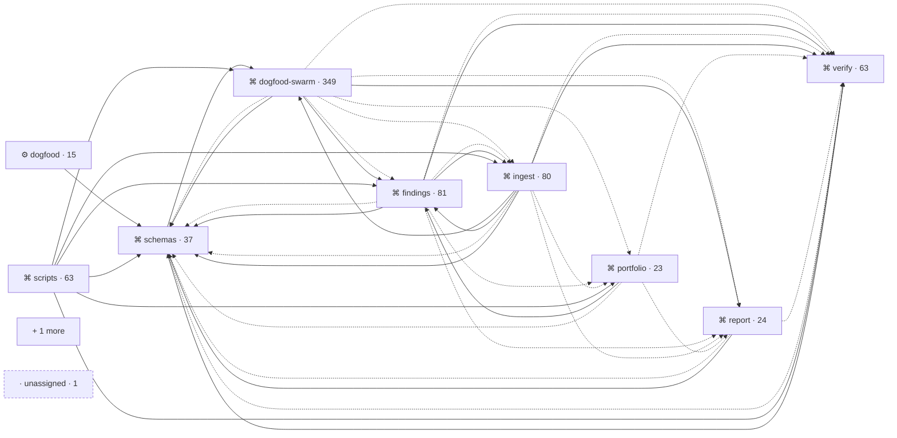

◷ numbers as of 2026-09-22 · 0 days ago

## What this is

unnamed: what this repository is
22 boundaries. 22 still unnamed.

If you maintain this repository: where to start, why it was built this way, what you will break.
If you are new here: where to start, why it was built this way, what you will break.

## Map

[+ 1 more](atlas/dev.md)

## Legend

────────▶   import        one boundary statically imports another
────────▣   chunk         same, recovered from a bundle; boundary grain, file unknown
· · · · ·   co-change     changed together, no import; width = strength
────────▶   low confidence: same shapes at 40% opacity; ⚠ and the words at full contrast

## Where to start
1. OPEN packages/schemas/src/index.ts
2. RUN npm test
   passes when: exit 0
3. BREAK Changing this breaks dogfood, dogfood-swarm, findings, ingest, report, scripts, verify; covered by tests in schemas (derived)
   tests that cover it: not covered by any test boundary

## What you will break — schemas

◷ numbers as of 2026-09-22 · 0 days ago

confidence: full

| relationship | boundaries |
| --- | --- |
| imports & co-changes | dogfood-swarm · findings · ingest · report · verify |
| imports only | dogfood · scripts |
| co-changes only | portfolio · root |

## Still unnamed
22 still unnamed. 1 unassigned file.
atlas/boundaries.yaml
