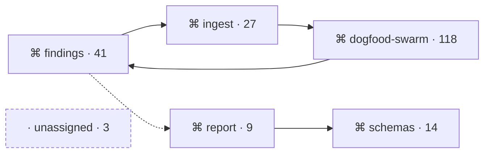

# Atlas — design spec (visual representation, profiles, surfaces, assets)

> **Status: superseded for the page (2026-09-22).** The three-profile anatomy in §3, the legend
> in §1.3 and the filtered map in §2 were built and rejected by the Director as a parts list,
> not a system. [atlas-page.spec.md](atlas-page.spec.md) now specifies the page. The rules in §0
> (colour is state, never identity; no state by colour alone; static surfaces), the asset
> library in §6 and the phone rule in §7 still apply to the site surfaces.

Atlas is an instrument for looking at how a system works. Twelve rounds of consult designed the
instrument's internals and nothing a person looks at. This is the missing half.

---

## 0. The rule that governs every choice below

**Show the map the same way everywhere.** One visual vocabulary, used identically in the
committed files, the dashboard panel, the per-repository page and the command line. A reader who
learns what a dashed border means on Orientation must not have to relearn it on Dev. This is the
"consistent layout" finding from software cartography applied across profiles as well as across
versions: a map that redraws itself between views is a map nobody trusts.

Three consequences that shape the rest:

- **Color encodes state, never identity.** Boundaries are identified by their name and by a
  stable position, not by hue. Categorical palettes stop being distinguishable at roughly eight
  entries, and a fleet repository can have twenty boundaries. Reserving color for the things a
  reader must act on (status, confidence, check result) keeps every color meaning one thing, and
  lets Atlas inherit the dashboard's existing semantic palette instead of inventing a second one.
- **No state is conveyed by color alone.** Every state has a glyph and a word beside the color.
  The evidence on notation says dual coding; the accessibility bar the handbook already enforces
  requires it.
- **Static by default.** The evidence says animation rarely beats a well-designed still. The
  committed files are static by nature; the site adds hover and filter, never motion.

---

## 1. The visual vocabulary

These are the atoms. Every diagram, table, badge and CLI line is built from them. They are listed
with what they encode, how they are drawn, and where the drawing comes from.

### 1.1 Tokens

Atlas uses the dashboard's existing custom properties. They already exist in both light and dark
and are the site's palette. Atlas adds nothing to the palette; it adds meanings.

| Token (existing) | Atlas meaning |
|---|---|
| `--ok`, `--ok-text`, `--ok-tint` | A check that passes. Nothing else. |
| `--bad`, `--bad-text`, `--bad-tint` | A check that fails. Nothing else. |
| `--flash` | Needs a human: `proposed` status, an age past 28 days, a low-confidence label. |
| `--neu-text`, `--neu-tint` | Counts and neutral badges: unresolved imports, unassigned files. |
| `--dim`, `--faint` | Secondary text; `deferred` boundaries; the unassigned tile. |
| `--focus` | Keyboard focus ring. |
| `--panel`, `--panel2`, `--border`, `--border2` | Tiles, cells, cards. |
| monospace stack (existing) | Every path, command, check name and hash. |

Nothing uses green to mean "accepted" or "healthy." Green is a passing check and nothing else,
because a reader who sees green relaxes, and a boundary being named is not a reason to relax.

### 1.2 Atoms

| Atom | Encodes | Drawn as | Notes |
|---|---|---|---|
| **Boundary tile** | One named boundary | Rounded rectangle, `--panel` fill, `--border`; name in the reader's font; role glyph left of the name; file count right | Position is stable across renders (sorted by name unless a layout is pinned). Never colored by identity. |
| **Status marker** | `proposed` / `accepted` / `deferred` | Hollow circle with `--flash` ring / filled circle, no tint / dash, `--faint` | Plus the word on hover and in any table. |
| **Role glyph** | `code` / `test` / `docs` / `config` | Four small glyphs from the glyph set (§6) | Role is the only attribute drawn on the tile besides name and count. |
| **Import edge** | A resolved static import between boundaries | Solid line, constant width, arrowhead at the importing side's target | No magnitude exists for imports, so width never varies. |
| **Chunk edge** | A boundary-level edge recovered from a bundle | Solid line, constant width, a **notched square** end cap instead of an arrowhead | It is not weaker or less certain than an import edge, so it is not dashed. It is a different grain, so it gets a different cap. |
| **Co-change edge** | Files changing together with no import between them | **Dotted** line; width scales with coupling strength | The one edge with a magnitude, so the one edge whose width means something. Flow-diagram rule: width is the only channel that carries the number. |
| **Low-confidence** | Statistics on the fallen floor | Lines and fills at reduced opacity, **plus** the ⚠ glyph and the words "low confidence" **at full contrast** | Three channels because this is the state most likely to be misread as "fine." Opacity is right for a line and wrong for type: the line fades, the words never do. |
| **Unresolved badge** | Import sites Atlas could not follow | Small pill on the tile's corner, `--neu-tint`, `?` glyph, the count | Absent when zero. Never hidden when nonzero. |
| **Unassigned tile** | Files no boundary claims | A tile at the map's edge with a **dashed** border, `--faint` text, the count | Dashed means "not a real boundary." This is the only dashed border in the vocabulary. |
| **Age line** | When statistics were computed | Clock glyph, relative time, absolute date; `--flash` at 28 days and beyond | The first line of any statistical section, every time, no exceptions. |
| **Action card** | One thing the reader can do | Three rows: a path (monospace, linked), a command or check name (monospace), the line that means it passed | On Machine the command row is a check *name*, never a shell command. |
| **Check chip** | Result of an existing check | `--ok` or `--bad` tint, check glyph, the check's name | The only place `--ok` appears. |
| **Divergence row** | One rule firing on one or two boundaries | Rule glyph, boundaries, the number, confidence marker, the row's stable id, open/cleared | Uses the dashboard's existing row style. |

### 1.3 Edge legend, as it renders

```text
────────▶   import        one boundary statically imports another
────────▣   chunk         same, recovered from a bundle; boundary grain, file unknown
· · · · ·   co-change     changed together, no import; width = strength
────────▶   low confidence: same shapes at 40% opacity; ⚠ and the words at full contrast
```

The legend is always visible on Orientation and collapsed but present on Dev. The evidence on
diagram comprehension is that experts scan global structure while newcomers need the legend
beside the picture; the two profiles differ in whether it starts open.

---

## 2. Diagram types, and which profile gets which

The engine dispatch chose formats on evidence. This section says where each appears.

| Diagram | Shows | Threshold | Orientation | Dev | Committed | Site |
|---|---|---|---|---|---|---|
| **Boundary map** (node-link) | Boundaries and the three edge kinds | Site: up to 20 boundaries, then the matrix | Yes, filtered to the start boundary and its direct neighbours, at most 8 tiles plus an overflow tile | Site: whole map when ≤ 20. **Committed: always**, at any size | Mermaid | SVG |
| **Import matrix** | Who imports whom, at scale | Above 20 boundaries | Never | Yes | No | SVG |
| **Hotspot treemap + table** | Where churn concentrates | Any | Never | Yes, always beside its table | Table only | Both |
| **Traced path** | One chain from a start file through what it reaches | Any | Yes, for the start file | On demand per file | Mermaid | SVG |
| **Breakage table** | The three-way split for a boundary | Any | Yes, for the start boundary | Yes, for every boundary | Markdown table | HTML table |
| **Divergence list** | Rules currently firing | Any | Count and link only | Full rows | No (central) | HTML rows |

Two rules from the evidence are enforced here and not left to taste. Node-link diagrams lose to
matrices above roughly twenty nodes for every task except tracing one path, so the map switches
to a matrix at that size on Dev and never appears at that size on Orientation. **That switch
applies to the site only.** A clone has no stylesheet, no fixed-width grid and no sticky headers,
so a committed matrix at twenty-five boundaries would be a wall of single characters in a
markdown table. The committed Dev file therefore always carries the Mermaid node-link map, at any
size, and above twenty boundaries the reader is told the matrix is on the site. Treemaps show
where the mass is and are read poorly for exact values, so a treemap is never drawn without its
sortable table beside it.

**Committed diagrams are Mermaid.** The engine dispatch left the text format open between Mermaid
and Graphviz. Mermaid renders natively in GitHub's markdown view, so the committed `atlas/` files
show their diagrams in the repository's own web view with no tooling installed. Graphviz does
not. The matrix and treemap cannot be expressed in Mermaid and are therefore site-only. Mermaid's
automatic layout is less stable across renders than a fixed one, which is a known cost; emitting
boundaries in name order keeps it mostly stable, and the site SVG uses a deterministic layout.

A committed boundary map, as emitted:



The role glyph, the count and the unassigned tile's dashed border all survive into Mermaid. The
chunk edge's notched cap does not; in Mermaid a chunk edge is drawn as an import edge with a
`chunk` label on the line, and the site SVG draws the cap.

---

## 3. Profile design

One derivation, three views. The engine dispatch already fixed what each profile *contains*.
This fixes what each looks like and in what order a reader meets things.

### 3.1 Orientation

**Density: low. Legend: open. One boundary at a time.** The reader has not got this repository
in their head. The evidence says they need to do something and be told they did it right, not
read prose, so the page is three actions with a caption, and everything else is subordinate to
them.

The first screen is the same for every reader who lacks the repository in their head. One line
at the top lets the reader say whether they maintain this repository or are new to it. That is
the only difference, and it changes the wording of the caption, not the content. **The committed
page cannot carry a toggle**, because a clone is a static file: the markdown holds both captions,
one line each, and is readable with neither selected. The site collapses them to the one the
reader picks.

```text
┌──────────────────────────────────────────────────────────────┐
│ ◷ numbers as of 2026-09-14 · 8 days ago                       │  age line (statistical), first
│   [ I maintain this ]  [ I'm new here ]                       │  site: toggle · clone: both lines
├──────────────────────────────────────────────────────────────┤
│ testing-os is the operating system for testing AI-assisted   │  what this is — ONE human-written
│ software: schemas, an evidence store, and a swarm protocol.  │  repository sentence (`summary`)
│ 7 boundaries. 1 still unnamed.                                │
├──────────────────────────────────────────────────────────────┤
│   ┌─────────┐      ┌──────────┐                               │  boundary map, filtered:
│   │⌘ findings│─────▶│⌘ ingest  │                               │  start boundary + neighbours
│   └────┬────┘      └────┬─────┘                               │  ≤ 8 tiles, legend below
│        │ · · · · · · · ·│                                      │
│   ┌────▼────┐      ┌────▼─────┐   ┌ ─ ─ ─ ─ ─ ┐              │
│   │⌘ report │      │⌘ swarm   │   │ unassigned │              │
│   └─────────┘      └──────────┘   └ ─ ─ ─ ─ ─ ┘              │
│   ┌ + 11 more ▸ ┐   import neighbours first, then co-change  │  overflow is a real tile
│   ──▶ import   ──▣ chunk   · · co-change                      │
├──────────────────────────────────────────────────────────────┤
│ 1  OPEN   packages/findings/index.js                          │  three actions, in order
│ 2  RUN    npm test --workspace @dogfood-lab/findings          │
│           passes when:     exit 0                             │
│ 3  BREAK  "Changing the reader's return shape breaks ingest." │  the authored sentence
│           tests that cover it:  ingest (12) · report (3)      │  the set, never one file
├──────────────────────────────────────────────────────────────┤
│ What you will break — findings                                │  breakage table, this boundary
│   imports & co-changes     ingest · dogfood-swarm             │
│   imports only             report                             │
│   co-changes only          schemas                            │
├──────────────────────────────────────────────────────────────┤
│ Still unnamed  ·  1 boundary, 3 files                  see ▸  │  what needs a human
└──────────────────────────────────────────────────────────────┘
```

Reading order, top to bottom, and why:

1. **Age first.** Already decided in the engine. A reader meets the age before any number.
2. **What this is.** One repository-level sentence, **written by a person**, held in a `summary`
   field at the repository level of `boundaries.yaml` beside the window and the budget. Not
   stitched from the boundary reasons: seven accepted reasons written at different times are not
   one paragraph, and a mechanical join is derived prose wearing a human voice. If the field is
   missing, the line reads "unnamed: what this repository is" and the rest of the page still
   works. Not a welcome. Not a threat. A reader who has never opened the repository needs to know
   what it is before what it breaks. *(The `summary` field is a design-driven addition to the
   engine's repository-level fields and is flagged here rather than silently written into the
   engine dispatch.)*
3. **The map, filtered.** The start boundary and its direct neighbours only. Never the whole
   system on this page. The legend sits directly beneath the picture, open. **Eight tiles is a
   cap with an overflow, not a truncation.** Import neighbours are shown first, then co-change
   neighbours, and when there are more than the cap allows the last tile is a real tile reading
   "+ N more" that links to Dev. A start boundary with fifteen neighbours shown as eight with
   seven silently dropped is a lie on the only map this reader sees. **The unassigned tile sits
   outside the cap, always.** It is the thing this page exists to show; if it competed for a
   slot, a busy start boundary would push it into the overflow and the reader would never see
   that anything is unnamed.
4. **Three actions.** Open, run, break. Each is an action card. The "run" card shows the command
   and the condition that means it passed, because being told you got it right is the thing the
   onboarding evidence says newcomers need and static pages never give. **That condition is
   `exit 0`, never a count.** "212 passing" is owned by the suite and changes the next time
   someone adds a test, after which the page tells a newcomer they failed when they did not.

   **The break card names the set of tests that cover the boundary, never one file.** An earlier
   draft named "the check that goes red: `ingest.test.js`", which is the same rot as the count in
   a different coat: in a real codebase breaking a reader's return shape does not fail exactly one
   file, it fails a compile or forty tests across three boundaries, and the promise drifts the
   first time the suite is consolidated. Atlas cannot know which file catches it without running
   mutation tests, which it does not. What it does know, from the engine, is which boundaries'
   tests cover this one: a boundary has tests when its own files match the conventions or a
   `test`-role boundary imports it. So the card names that set, with counts, and tells the reader
   to break it and watch that set fail. Neither card quotes a number or a filename the suite
   owns.
5. **The breakage table** for this one boundary, with the confidence marker.
6. **What still needs a human.** The unnamed count and a link. This is the page's only call to
   contribute, and it is last.

What Orientation never shows: the matrix, the treemap, the roster, symbols, the divergence rows
beyond a count. Those belong to someone who is staying.

**The committed copy is this page in markdown**: the age line, the paragraph, the Mermaid map,
the three actions as a list, the breakage table, the unnamed count. A clone contains all of it.

### 3.2 Dev

**Density: high. Legend: collapsed. The whole system.** The reader is staying and knows the
vocabulary. Progressive disclosure runs boundary → file → symbol; symbols exist on this page and
nowhere else.

```text
┌──────────────────────────────────────────────────────────────┐
│ ◷ numbers as of 2026-09-14 · 8 days ago     structure @ a4f1c2 │  age + generating commit
├───────────────────────────────┬──────────────────────────────┤
│  BOUNDARY MAP (≤20) or MATRIX │  HOTSPOTS                    │
│                               │  ┌───────┬──┬────┐           │
│   [matrix: rows import cols]  │  │ swarm │  │    │  treemap  │
│    ■ import  ▣ chunk  ▒ co-ch │  │       ├──┼────┤  area =   │
│                               │  ├───────┤  │    │  churn    │
│   sort: name · fan-in · fan-out│  └───────┴──┴────┘           │
│                               │  boundary   churn  coupl  ?  │  the table, sortable
│                               │  swarm       0.41   0.62   4 │
│                               │  findings    0.22   0.58   0 │
├───────────────────────────────┴──────────────────────────────┤
│  DIVERGENCE  · 2 open                                         │
│  ⇄ two-may-be-one   findings ↔ ingest    0.71   ● full  open  │  divergence rows
│  ⤳ file-moved       swarm/lib/x.js → ingest   ⚠ low   open   │
├──────────────────────────────────────────────────────────────┤
│  ROSTER                                        legend ▸       │
│  ▸ findings  (41)   ▸ ingest (27)   ▸ dogfood-swarm (118) …   │  boundary → files → symbols
│    ▸ unassigned (3)   ? unresolved by boundary: swarm 4        │
└──────────────────────────────────────────────────────────────┘
```

Rules specific to Dev:

- **Matrix cells carry the three edge kinds as three fills**: solid for import, notched for
  chunk, hatched for co-change, and both fills when both exist. Row and column headers are the
  boundary names; the diagonal is blank. Sorting by fan-in or fan-out reorders both axes together.
- **The treemap tile encodes one variable: area = churn.** Nothing else on the tile, because
  area is already read imprecisely. The table beside it carries the exact churn, coupling
  density, and unresolved count, and every column sorts.
- **The roster is a tree**, collapsed at the boundary level. Opening a boundary lists its files;
  opening a file, **on the site only**, lists its exported top-level definitions. This is the
  only place symbols appear in Atlas, and it is bounded on purpose. The engine's atom is the
  file and its edges are file-level; symbols are a lookup detail, not part of the graph. They
  come from the same parse tree the import extractor already walks, so they cost no second
  pipeline, but they are limited to exported top-level definitions (not every name), they are
  never committed to the clone, and the roster is collapsed so the payload is not rendered until
  a reader opens a file. The UX does not exceed the engine's resolution; it exposes what the
  engine already parsed, at the place where a reader who is staying would look for it.
- **The divergence rows are the dashboard's rows.** Same height, same hover, same column
  rhythm, so a reader coming from the fleet panel is on familiar ground.

**The committed copy** is the Mermaid map, the breakage table for every boundary, the roster as
a nested list **to file depth**, and the hotspot table. The matrix, the treemap and the symbol
level of the roster are site-only.

### 3.3 Machine

Not a visual profile, but it has a shape, and the shape is the design. The whole point of the
Machine profile is that a reader with a small budget meets the important lines first.

```text
atlas/machine.md — first lines, in this order, always:

  generated: a4f1c2e  2026-09-14T09:12:00Z
  structure: 7 boundaries · 1 unassigned · 4 unresolved sites
  statistics: atlas/machine-stats.txt · hash 9b3f… · withdraw-after: 2026-10-12T09:12:00Z
  rule: if now (UTC) is after withdraw-after, do not load the statistics file;
        withdrawn numbers are not evidence that files are uncoupled
  confidence: full        (or: low — shared-commit floor fell to 3)

  [coarse: one line per boundary — name, role, file count, imports →, imported by ←]
  [fine: the top-ranked boundaries expanded — entry points, edges by file, unresolved sites]
```

The withdraw stamp is a full ISO-8601 UTC timestamp at the same precision as `generated`, never
a bare date. A bare date has no timezone, and a loader on a runner in one zone would include the
statistics while a loader in another dropped them on the same calendar day, which is flaky
ingestion by design. Generated plus exactly 28 days, in UTC, compared in UTC.

The statistics file is plain text and not YAML or JSON, per the engine dispatch: a loader that
sees a data extension parses it, a parser meeting prose throws, and a comment carrying the
withdrawal is stripped on the way in. A structured-data extension cannot carry a prose rule.

Coarse before fine, ranked before exhaustive, the budget enforced by truncating the fine section
and never the coarse one. No shell command anywhere in the file. The statistics file opens with
the same withdraw line before any number.

**The extension and the content are two different decisions.** The extension is `.txt` because
of how loaders behave: a markdown extension is swept up by the common `**/*.md` glob, and a data
extension is parsed, which throws on the prose rule or strips it as a comment. The content is
**markdown-formatted tables**, because of how models read: the breakage split, the coupling
pairs and the churn ranking are tabular, and a model parses a pipe table far more reliably than a
bespoke ASCII layout it has never seen. A plain-text file carrying markdown tables satisfies
both. Going back to a `.md` extension to get the tables would reopen the glob problem the
extension was changed to close.

---

## 4. Surfaces

Where the profiles appear, and what each surface owns.

| Surface | What it shows | Profile | Interactive | Notes |
|---|---|---|---|---|
| **`atlas/` in the repository** | Orientation and Dev as markdown, `machine.md`, `machine-stats.txt`, `boundaries.yaml` | All three | No | The drift evidence lives here. Mermaid renders in GitHub's own view. |
| **Dashboard panel** | One row per public repository | — | Sort, filter | A new row set in the existing dashboard, not a new page. |
| **Per-repository page** (site) | Orientation on top, Dev beneath a disclosure | Orientation → Dev | Hover, filter, sort | One page, two depths. The reader picks how far down to go. |
| **Handbook page** | What Atlas is, how to read the vocabulary, the legend | — | No | One page. Not eighty-five maps. |
| **Command line** | `init` proposals, `map` summary, `check` results | — | No | Same error shape as the rest of the repository. |

### 4.1 The dashboard panel

```text
ATLAS · 90 repositories rendered · weekly · last run 2 days ago
────────────────────────────────────────────────────────────────────────
repository          map age   boundaries   unnamed   unresolved   open ⇄   
testing-os          8 d       7            1         4            2        ▸
ai-rpg-engine       31 d ⚠    12           0         0            0        ▸
motif               2 d       16           4         11           5        ▸
…
```

The header counts the rows the job actually rendered, across both organizations, including the
five in this repository's own; it is never a hardcoded fleet size. Columns: repository, map age
(`--flash` at 28 days), boundary count, unnamed count, unresolved count, open divergence count,
link. Sortable by every column. The default sort is open
divergences descending, so the repositories that most need a human are at the top. Age is
relative with the absolute date on hover.

### 4.2 The per-repository page

Orientation as specified in §3.1, then a single disclosure control reading **Show the full map**,
which reveals Dev as specified in §3.2 beneath it. One URL. A reader who wants only the first
screen never scrolls past it; a reader who wants the matrix gets it on the same page. This is
progressive disclosure over one underlying model, which is what the evidence says serves both
audiences without maintaining two pages.

The page names the commit it was rendered against and shows the age of the render in the same
age-line form as everything else. If the repository has moved and has not been rendered in
fourteen days, the age line says so in `--flash`. It never fails anything.

**Added 2026-09-23: two pictures and one line.** Each is read from data the render branch
already carries, and none carries meaning by colour.

- **What breaks what** is followed by a picture of its own list: one row per part, a solid
  bar as long as the number of parts that import it to run it, a thinner dashed bar
  continuing it for the parts that import it only from tests, and the doors on its path as
  a numeral. Dashed is the vocabulary's mark for evidence short of running code, the same
  atom the flow picture uses for a reader found by text, and the number at the bar's end
  says in words what the dashed length says in line. `page.json` also carries `edges`, the
  imports among the listed parts, for a later layer that joins the rows; nothing draws
  them yet. Below 600 px the picture is not drawn, because the list above it says the same.
- **What changed since the last map** is followed by a strip read from `history.json`,
  which the weekly job appends to beside each page and keeps at fifty-two entries. One
  column per render; its height is the number of structural changes that render named,
  and height is the only encoding. A headline that is an import carries the import mark,
  and one that closes a cycle carries the strongest mark, a heavier cycle arrow. The
  dashboard's sprite holds only the age and low-confidence marks, and neither means a
  change, so the strip draws the import edge's ▶ from §6.1 and adds one mark for the
  cycle rather than borrowing one that means something else. A sentence under
  the strip counts the renders, how many changed the structure, and the largest. Below
  600 px the columns drop and the sentence stays. A render made before the history existed
  shows no strip.
- **The one line a person may write** sits under the mapped-at line. When the summary is
  empty, the page says so and links to GitHub's editor for `atlas/boundaries.yaml`; when it
  is present, the page shows it marked as written by a person, with a small link to
  correct it. The site writes nothing.

```text
part           imported by                          doors
schemas        ━━━━━━━━━━━━━━━━━━┄┄┄┄┄┄ 6 + 2 from tests   4
findings       ━━━━━━━━━┄┄┄ 3 + 1 from tests               3
ingest         ━━━━━━ 2                                    3
portfolio      ━━━ 1                                       3
```

### 4.3 The command line

Three commands, each with a fixed output shape.

`atlas init` proposes and says what it concluded and from which facts, so the human corrects a
claim rather than filling a blank:

```text
proposed 7 boundaries from package manifests (packages/*)

  findings      code    41 files   entry: packages/findings/index.js
                reason (derived): exports a reader, a validator, and four pipelines;
                                  imported by ingest and dogfood-swarm
  …
  unassigned            3 files    scripts/legacy-*.mjs

wrote atlas/boundaries.yaml with status: proposed
next: edit each derived reason into your own words, then set status: accepted
```

`atlas check` fails with the repository's error shape: a stable code, one sentence, a non-zero
exit, and the code listed on the handbook's error page:

```text
ATLAS_STRUCTURE_DRIFT  boundary edge findings → report is not in the committed map
  what changed:   packages/findings/derive/summary.js now imports @dogfood-lab/report
  what to do:     run `atlas map` and commit atlas/, or remove the import
exit 1
```

Every failure names what changed and what to do. The second line is not optional. The evidence
on tool adoption says an instrument that shows a problem without an action is admired once and
then ignored; the CLI is where that rule bites hardest, because a red check with no next step is
a check someone deletes from the job.

`atlas map` prints a one-screen summary: counts, the age it stamped, the confidence level, and
any divergence it computed, then the files it wrote.

---

## 5. States

Every state the map can be in, and how each is shown. A state that is not in this table is not
allowed to exist silently.

| State | Where it shows | How |
|---|---|---|
| **No atlas directory** | CLI, dashboard | CLI: a notice, exit 0. Dashboard: the row reads "not mapped" in `--faint`, with a link to the handbook page. |
| **Proposed** (init run, not accepted) | Every tile, the page header | Hollow `--flash` status marker on every tile; a header line "proposed — not yet accepted"; Orientation's paragraph reads "Atlas proposes that…" |
| **Accepted** | Tiles | Filled marker, no tint. The default look. |
| **Deferred** boundary | Tiles, Orientation | `--faint` tile with a dash marker; listed under "still unnamed" on Orientation with its reason. |
| **Low confidence** (fallen floor) | Every statistical element | Lines and fills at reduced opacity; the ⚠ glyph and the words "low confidence" **at full contrast**, never faded. The high-water mark is frozen and the divergence rows say so. |
| **Withdrawn** (Machine, past 28 days) | `machine.md`, `machine-stats.txt` | The withdraw line at the top of both. The Orientation and Dev pages show the age in `--flash` but do not withdraw. |
| **Stale render** (site, moved 14+ days) | Per-repository page, dashboard row | Age in `--flash`. Nothing fails. |
| **Structural drift** | CLI | `ATLAS_STRUCTURE_DRIFT`, exit 1, what changed and what to do. |
| **Rebaseline waiting** | Dashboard row, per-repository page | A `--flash` note: "rebaseline requested at `<hash>`, waiting on a committed `atlas map`." |
| **Parse failure** | Dashboard row | The row reads "render failed: <grammar>" in `--bad-text`; the link goes to the last good render if one exists. |
| **Private repository** | Nowhere central | No row, no page, no count. The absence is the design. |
| **Unresolved > resolved** | Import matrix, map | The whole matrix carries the low-confidence treatment and a line reading "more import sites unresolved than resolved." |

---

## 6. Asset library

What has to be built, drawn or written for the above to exist. This is the list the build slices
draw from.

### 6.1 Glyph set — one symbol per meaning, twenty-one marks, one sprite

| Glyph | Meaning | Where |
|---|---|---|
| ⌘ `code` | role | tiles, roster, CLI |
| ⚗ `test` | role | tiles, roster, CLI |
| ¶ `docs` | role | tiles, roster, CLI |
| ⚙ `config` | role | tiles, roster, CLI |
| ○ `proposed` | status | tiles |
| ● `accepted` | status | tiles |
| – `deferred` | status | tiles |
| ◷ age | statistical age | every age line |
| ⚠ low confidence | confidence | anything on the fallen floor |
| ? unresolved | count | tile badge, matrix, roster |
| ▶ import / ▣ chunk / ⋯ co-change | edge kind | legends, matrix cells |
| ⇄ two-may-be-one / ⤳ file-moved / ⇣ cohesion-drop / ⇢ leaks | divergence rule | divergence rows |
| ▸ open / ▾ opened | disclosure | roster, per-repo page |
| ✓ pass / ✗ fail | check result | check chips, CLI |

Drawn once as a symbol sprite; referenced by id everywhere; each symbol carries a `<title>`.

**One mark, one meaning, with no exceptions.** An earlier draft used ✓ for both the `test` role
and a passing check, which is the same error as using green for two things and would have put a
"passing" mark on every test boundary's tile. The test role now has its own mark. ✓ means a check
passed and nothing else. The table has fourteen rows and twenty-one marks; the sprite is built per
mark, not per row.

### 6.2 Diagram primitives — the SVG renderer

- Boundary tile (name, role glyph, count, status marker, optional unresolved badge)
- Unassigned tile (dashed)
- Edge: import (arrow), chunk (notched cap), co-change (dotted, width from strength)
- Matrix: header row/column, cell with three fills, sort control
- Treemap: squarified layout, area from churn, label if the tile is wide enough, otherwise none
- Traced path: a vertical chain of tiles joined by edges
- Legend block, open and collapsed variants
- Age line
- Action card
- Check chip
- Divergence row

Every rendered SVG root carries `<title>`, `<desc>`, `role="img"` and an `aria-labelledby`
referencing both, which is the bar the handbook's existing imagery test already enforces. The
description narrates the diagram: boundaries, edge counts by kind, unresolved and unassigned
counts. That narration is generated from the same data as the picture, so it cannot drift from
it.

### 6.3 Mermaid theme

There is no Mermaid theme, and an earlier draft that promised one was wrong. GitHub renders
Mermaid with its own theme and does not reliably honour an `%%{init}%%` block, so a committed
diagram cannot promise the dashboard palette and must not hardcode a hex value that is only the
dark-mode value of one token. **The committed picture is allowed to look like GitHub.** What
survives into Mermaid is structure only: the tiles, the counts, the role glyphs, the edge kinds
by line style, and the `unassigned` class as a stroke pattern with no color. The site SVG uses the
tokens; the clone does not, and that is the correct division.

### 6.4 Templates

- Orientation page (markdown, committed) and Orientation section (HTML, site)
- Dev page (markdown, committed) and Dev section (HTML, site)
- `machine.md` and `machine-stats.txt` head blocks
- Dashboard panel row
- Per-repository page shell with the disclosure control
- Handbook page
- CLI output: `init` proposal, `check` failure, `map` summary

### 6.5 Stylesheet

One CSS file for the site surfaces, consuming the dashboard's custom properties and adding only
Atlas-specific rules (tile, edge, badge, matrix cell, disclosure). No new color values. Included by
the dashboard and the per-repository page; the handbook page uses Starlight's own styles plus the
glyph sprite.

---

## 7. Responsive and accessible

**Phone width is a first-class layout, not a degraded one.**

| Element | ≥ 768 px | < 768 px |
|---|---|---|
| Boundary map | Left-to-right Mermaid / SVG | Top-to-bottom; tiles full width |
| Import matrix | Grid | Becomes a **boundary picker**: one control selects a boundary and the page shows only that boundary's "imports →" and "← imported by". Never a flattened list: at twenty-five boundaries and a hundred edges that list is dozens of swipes long and un-navigable, which is a data dump, not a layout. |
| Treemap + table | Side by side | Table only; the treemap is dropped, not squashed |
| Dev two-column | Map beside hotspots | Stacked, map first |
| Action cards | Three rows | Unchanged; already vertical |
| Dashboard panel | All columns | Repository, age, open divergences; the rest on the row's detail |

Accessibility, restated as rules rather than aspirations:

- No state is color-only. Every state has a glyph and a word.
- Every SVG has title, description, role and the aria reference. The description is generated
  from the data.
- Every interactive element on the site is reachable by keyboard and shows the `--focus` ring.
  Matrix cells are focusable and announce "row imports column" or the absence.
- Contrast on both palettes meets the same bar the dashboard already meets; Atlas adds no colors,
  so it inherits the dashboard's compliance rather than needing its own audit.
- Committed markdown is readable without any stylesheet at all, because a clone has none.

---

## 8. Open design decisions

Named so they are decided rather than discovered.

1. **The glyphs need drawing.** The twenty-one marks in §6.1 are placeholders for meaning, not
   final marks. They need a pass by someone who draws, at 16 px, in both palettes. (An earlier
   version of this item said fourteen and would have shipped the old set with ✓ used twice.)
2. **Whether boundaries should ever carry an identity hue.** This spec says no, for the reasons
   in §0. If a fleet repository with six boundaries turns out to read better with hue, that is a
   per-repository option, not a default.
3. **The Mermaid layout stability cost.** Name-ordered emission keeps it mostly stable. If it
   proves not stable enough, the committed map switches to a pinned-position format and loses
   GitHub-native rendering. That trade should be measured on real repositories before deciding.
4. **Resolved.** The Orientation paragraph was going to be stitched from accepted reasons; both
   reviewers rejected that independently and it is now one human-written repository-level
   `summary` (§3.1). Kept in this list so the reasoning is not lost.
5. **Whether Orientation's filtered map should include edges to unnamed boundaries.** Showing them
   tells the reader something is unnamed; hiding them keeps the first screen clean. Not decided.

---

## 9. What this spec does not do

It does not change the engine. It does not pick who reads a profile; the reader does. It does not
add a color. It does not add a surface beyond the dashboard, the site page and the handbook page.
It does not make a committed file interactive. It does not put a shell command in the Machine
file. Every one of those is a decision already made, and this document only draws them.
